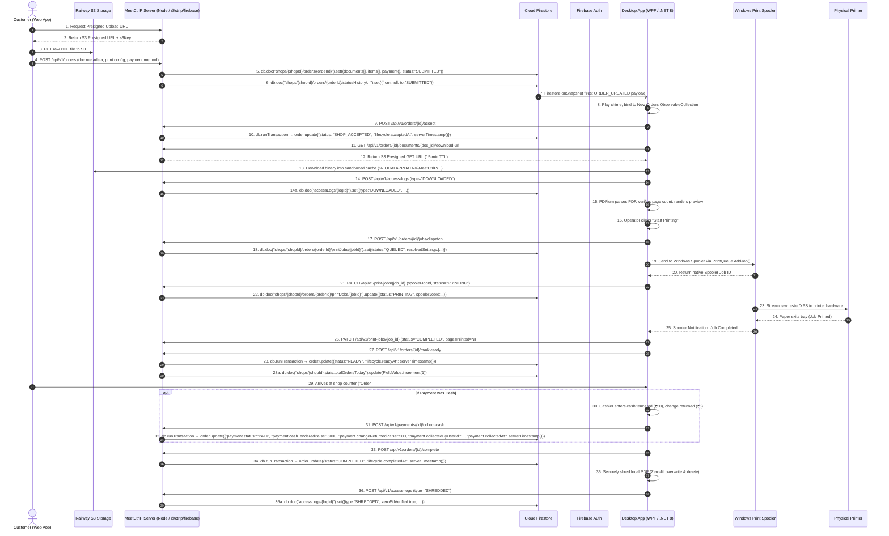

# Section 00: Comprehensive Data Flow, Storage Matrix & Client-to-Database Contracts

## 1. Executive Summary & Storage Topology

MeetCtrlP operates on a strictly partitioned hybrid data architecture. Data is distributed across four distinct storage tiers, each with clear ownership, security boundaries, and access rules:

```text
┌─────────────────────────────────────────────────────────────────────────────────────────────────┐
│                                   MEETCTRLP DATA TOPOLOGY                                        │
├──────────────────────────┬──────────────────────────┬─────────────────────────┬──────────────────┤
│    1. FIREBASE AUTH      │  2. CLOUD FIRESTORE      │  3. RAILWAY S3 STORAGE  │ 4. CLIENT DESKTOP│
│   (Identity Toolkit)     │  (Realtime / Offline SDK)│    (Object Storage)     │ (Local Win32)    │
├──────────────────────────┼──────────────────────────┼─────────────────────────┼──────────────────┤
│ • User Passwords & Salts │ • Shop & Business Profile│ • Raw PDF binaries      │ • DPAPI Tokens   │
│ • Firebase UID (localId) │ • Staff Users & Roles    │ • Presigned PUT uploads │ • Win32 Spooler  │
│ • ID Tokens (1h expiry)  │ • Pricing & Capabilities │ • Presigned GET URLs    │ • PDF Cache      │
│ • Refresh Tokens         │ • Orders & Status        │   (15-min TTL)          │ • WMI Hardware   │
│ • Internal Phone Emails  │ • Print Jobs & Spooler   │                         │ • Serilog Logs   │
│   ({digits}@phone...)    │ • Payments (embedded)    │                         │                  │
│ • Token Revocation State │ • Hardware Telemetry     │                         │                  │
│                          │ • Idempotency Keys       │                         │                  │
│                          │ • Immutable Audit Logs   │                         │                  │
└──────────────────────────┴──────────────────────────┴─────────────────────────┴──────────────────┘
```

> **CRITICAL SECURITY BOUNDARY:** The Windows Desktop Application **NEVER imports or connects directly to the Firebase Client SDK or S3 SDK**. All authentication credentials, password checks, and file presigning operations are brokered through `apps/server` REST APIs. S3 secrets and Firebase Service Account keys remain strictly on the backend.

---

## 2. Global Storage Tier Responsibility Matrix

| Data Domain / Entity | Firebase Auth | Cloud Firestore (Collection Path) | Railway S3 | Client Desktop | Reason & Access Pattern |
| :--- | :---: | :--- | :---: | :---: | :--- |
| **Passwords & Password Hashes** | **YES** | — | NO | NO | Owned by Firebase Identity Toolkit. |
| **Firebase UID (`firebaseUid`)** | **YES** | **YES** `/shops/{shopId}/users/{userId}.firebaseUid` | NO | NO | Stable join key linking Firebase Auth to Firestore user document. |
| **Shop Owner Real Email / Phone** | NO | **YES** `/shops/{shopId}/users/{userId}` | NO | In-Memory | Real Indian phone numbers and contact emails live in Firestore. |
| **Internal Phone Mapping Email** | **YES** | NO | NO | NO | Firebase requires email; phone-only users map to `{digits}@phone.meetctrlp.app`. Never exposed to client. |
| **ID Token & Refresh Token** | **YES** | NO | NO | **YES** (DPAPI) | Issued by Firebase; stored in Windows Credential Manager / DPAPI on desktop. |
| **Shop Profile & Operating Hours** | NO | **YES** `/shops/{shopId}` | NO | Cached | Authoritative shop profile, location, business hours, embedded `pricing{}` map. |
| **Shop Services & Pricing** | NO | **YES** `/shops/{shopId}.pricing` (embedded map) | NO | Cached | Per-page rates in minor units (paise). Realtime `onSnapshot` listener on desktop. |
| **Customer Orders & Status** | NO | **YES** `/shops/{shopId}/orders/{orderId}` | NO | Reactive MVVM | Business lifecycle records. Realtime Firestore listener feeds WPF `ObservableCollection`. |
| **Order Financial Items** | NO | **YES** `/shops/{shopId}/orders/{orderId}.items[]` (embedded array) | NO | Observable | Frozen historical price snapshot embedded inside order document. |
| **Raw PDF File Content** | NO | NO | **YES** `uploads/...` | Temp Cached | Stored in Railway S3. Desktop downloads via presigned URL, prints, then securely shreds. |
| **Document Metadata (Pages, Hash)** | NO | **YES** `/shops/{shopId}/orders/{orderId}.documents[]` (embedded array) | NO | Validated | Page count, MIME, file size, SHA-256, s3Key — embedded in order document. |
| **Print Agent Device Record** | NO | **YES** `/shops/{shopId}/agents/{agentId}` | NO | Hardware ID | Machine GUID, OS version, agent version, pairing status. |
| **Hardware Printers & Config** | NO | **YES** `/shops/{shopId}/printers/{printerId}` | NO | Spooler API | Discovered Win32 printer names, ports, driver, capabilities, `defaultPrintSettings` map. |
| **Physical Print Jobs** | NO | **YES** `/shops/{shopId}/orders/{orderId}/printJobs/{jobId}` | NO | Active Spool | Spooler Job ID, pages printed, status, retries, error messages. |
| **Hardware Telemetry & Jams** | NO | **YES** `/shops/{shopId}/printers/{printerId}/telemetry/{logId}` | NO | WMI Polling | Paper jams, offline state, out-of-paper events polled every 5 s. |
| **Payments (Cash & Online)** | NO | **YES** `/shops/{shopId}/orders/{orderId}.payment{}` (embedded map) | NO | Cashier UI | Payment method, status, cashier identity, change — all embedded in the order document. |
| **Offline Action Queue** | NO | Firestore SDK native local cache | NO | **YES** (LevelDB/SQLite inside SDK) | Firestore SDK offline persistence automatically queues mutations and replays on reconnect. No custom SQLite journal needed. |
| **Document Access Audit** | NO | **YES** `/accessLogs/{logId}` (immutable, top-level) | NO | Logged | Immutable audit log of every download, preview, spool, and zero-fill shred. |
| **Order Status History** | NO | **YES** `/shops/{shopId}/orders/{orderId}/statusHistory/{historyId}` | NO | NO | Append-only audit trail for every order lifecycle state transition. |
| **Idempotency Keys** | NO | **YES** `/idempotencyKeys/{key}` (TTL 24h) | NO | NO | Server-side deduplication guard. Prevents duplicate mutations from offline replay. |

---

## 3. End-to-End Data Flow Pipeline

The complete flow from customer upload to physical printer execution and Firestore settlement:



---

## 4. Key Data Point Acquisition & Transformation Contracts

### 4.1 Client Authentication Data Points
- **Acquisition:** Operator types email/phone and password into `LoginWindow.xaml`.
- **Transmission:** `POST /api/auth/login` to `apps/server` (JSON payload `{ identifier, password }`).
- **Processing:** `apps/server` normalizes phone to `+91...`, resolves internal email (`{digits}@phone.meetctrlp.app`), and calls Firebase Identity Toolkit REST `signInWithPassword`.
- **Storage Target:**
  - **Firebase Auth:** Issues ID Token (`idToken`, 1-hour TTL) and Refresh Token (`refreshToken`).
  - **Cloud Firestore** `/shops/{shopId}/users/{userId}`: Updates `lastLoginAt` field via `FieldValue.serverTimestamp()`.
  - **Windows Desktop:** Encrypts `refreshToken` via **Windows DPAPI** into Windows Credential Manager (`Ctrlp.Desktop/refreshToken`); keeps `idToken` strictly in-memory.

### 4.2 Hardware & Printer Discovery Data Points
- **Acquisition:** Background service queries Windows Win32 API (`LocalPrintServer.GetPrintQueues()`) and WMI query (`SELECT * FROM Win32_Printer`).
- **Data Points Captured:**
  - System Name (`pq.FullName`)
  - Driver Name (`pq.QueueDriver.Name`)
  - Port Name (`pq.QueuePort.Name`)
  - Color Capability (`OutputColorCapability.Contains(OutputColor.Color)`)
  - Paper Size Capabilities (`PageMediaSizeCapability`)
  - Hardware Status Flags (`IsOffline`, `IsPaperJam`, `IsOutOfPaper`, `IsDoorOpened`)
- **Transmission:** Bundled into `POST /api/v1/devices/{agent_id}/printers/sync`.
- **Storage Target:**
  - **Cloud Firestore** `/shops/{shopId}/printers/{printerId}`: Batch-upserted via `WriteBatch`. Telemetry events appended to `/shops/{shopId}/printers/{printerId}/telemetry/{logId}`.
  - **Client UI:** Binds to `PrintersViewModel.DiscoveredPrinters` via Firestore `onSnapshot` on the printers subcollection.

### 4.3 Document & Print Configuration Data Points
- **Acquisition:**
  - Page count & Dimensions: Extracted by `PDFium` parser on desktop client upon local file inspection.
  - Page selection: Operator or customer string (e.g. `"1,3,5-8"`).
- **Processing:** `PageSelectionParser.ParseAndValidate()` checks selected pages $\le \text{pageCount}$.
- **Storage Target:**
  - **Railway S3:** Raw PDF file bytes.
  - **Cloud Firestore** `/shops/{shopId}/orders/{orderId}.documents[]` (embedded array): Stores `storageKey`, `fileSizeBytes`, `pageCount`, `mimeType`, `sha256Hash`, and `config{}` map (`colorMode`, `copies`, `paperSize`, `pageSelection`).
  - **Client UI:** Rendered into high-fidelity WPF canvas with vector zoom and page thumbnails.

### 4.4 Cash Collection & Counter Financials
- **Acquisition:** Cashier enters amount received into `CashCollectionDialog.xaml`.
- **Data Points Captured:**
  - `amountPaise` (e.g. 4500 paise = ₹45.00)
  - `cashTenderedPaise` (e.g. 5000 paise = ₹50.00)
  - `changeReturnedPaise` (e.g. 500 paise = ₹5.00)
  - `collectedByUserId` (UID of logged-in staff)
  - `collectedAt` (Firestore server timestamp at physical handover)
- **Transmission:** `POST /api/v1/payments/{payment_id}/collect-cash`.
- **Storage Target:**
  - **Cloud Firestore** `/shops/{shopId}/orders/{orderId}.payment{}` (embedded map): Atomically updated via `db.runTransaction` to prevent double-collection. Simultaneously increments `/shops/{shopId}.stats.cashInDrawerTodayPaise` using `FieldValue.increment()`.
  - **Client UI:** Updates Dashboard `Cash in Drawer` and `Cash Pending` metric counters immediately via the live `onSnapshot` on `/shops/{shopId}`.

### 4.5 Offline Mutation Data Points
- **Acquisition:** Operator performs action (e.g. Accept Order, Collect Cash, Complete Order) while internet connection is severed.
- **Storage Target:**
  - **Firestore SDK Native Offline Cache (LevelDB/SQLite inside SDK):** Mutations are automatically queued in the Firestore SDK's local persistence layer. No custom SQLite journal or bespoke queue code is required.
  - **Client UI:** Firestore SDK surfaces a `PendingWrites` observable. Desktop shows amber warning pill: `Offline – N writes queued`.
- **Synchronization:** Upon network reconnection, Firestore SDK automatically replays queued mutations with server-authoritative timestamps. The `/idempotencyKeys/{key}` top-level Firestore collection prevents duplicates: server writes the idempotency key atomically with each mutating operation.

---

## 5. Firestore Realtime Listener Architecture (Desktop)

The WPF desktop app registers Firestore listeners at startup through `apps/server` REST endpoints that proxy Firestore data as Server-Sent Events (SSE) or via the Firebase REST API long-polling. The desktop never holds a direct Firestore SDK connection.

| Screen / Feature | Firestore Subscription Path | Trigger Condition |
| :--- | :--- | :--- |
| New Order Queue | `/shops/{shopId}/orders` where `status == "SUBMITTED"` | Any new `SUBMITTED` order document |
| Active Order Card | `/shops/{shopId}/orders/{orderId}` | Any field change on the order |
| Print Job Progress | `/shops/{shopId}/orders/{orderId}/printJobs` | Job status or `pagesPrinted` change |
| Printer Status Panel | `/shops/{shopId}/printers` | Any printer document field change |
| Dashboard Counters | `/shops/{shopId}` (`.stats{}` map) | Shop-level stats incremented by `FieldValue.increment()` |
| Pickup Code Scanner | `/shops/{shopId}/orders` where `pickupCode == X` and `status == "READY"` | One-shot lookup for handover |
