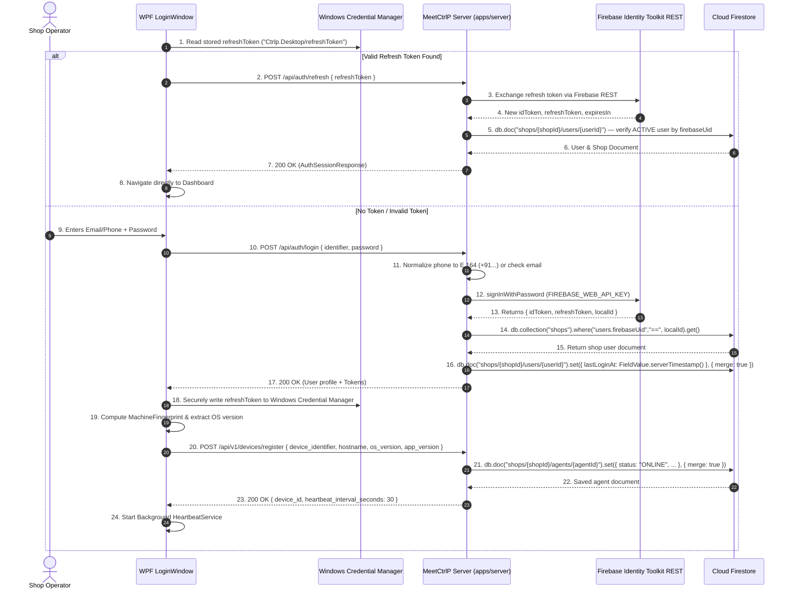

# Section 01: Shop, Account & Device Authentication

## 1. Product Requirements & MVP Scope

Based on `FRD_MVP.md` and `meetctrlp_print_shop_partner_desktop_mvp_requirements.md`:

| Feature | Scope | Rationale / Day-0 Requirement |
|---------|-------|-------------------------------|
| **Shop Authentication** | **T0** | The desktop application must securely identify which shop and staff operator it belongs to. |
| **Device Registration** | **T0** | The desktop computer acts as a trusted local print controller. The backend must authorize the physical machine. |
| **Sign Out** | **T0** | Mandatory for security on shared shop hardware (staff shifts, closing time). Clears tokens and in-memory caches. |
| **Device Status (Online/Offline)** | **T0** | Realtime visibility of machine connectivity. Enables backend to avoid routing orders to dead devices. |
| **Print Agent Version** | **T0** | Critical compatibility check. If local agent and cloud schema diverge, physical printing fails. |
| **Application Version** | **T1** | Displayed in Settings/Footer for diagnostics, support tickets, and update notifications. |
| **Shop Profile Management** | **T1** | Core shop name and address are read-only on desktop; deep profile editing is handled via web dashboard. |
| **Multi-Staff Account Management** | **T1** | Owner can see active staff; role switching / permission grants are managed via web portal. |

---

## 2. Data Points & Storage Matrix (Firebase vs Cloud Firestore vs Client)

Authentication and device telemetry are split between Firebase Authentication, Cloud Firestore, and local Windows storage:

| Data Point | Origin / Capture Source | Client Capture Method | Transport / DTO Format | Destination Storage | Storage Format & Constraints |
| :--- | :--- | :--- | :--- | :--- | :--- |
| **Operator Identifier** | Operator Input | WPF `LoginWindow.xaml` (TextBox) | JSON `{ identifier: "..." }` | Transient | Real email or Indian phone (+91...) |
| **Password** | Operator Input | WPF `PasswordBox.Password` | JSON `{ password: "..." }` | **Firebase Auth** | Bcrypt hash inside Firebase Auth (never stored in Firestore) |
| **Internal Phone Email** | Generated on Backend | `phoneToFirebaseEmail(+91...)` | Internal Server Only | **Firebase Auth** | `{digits}@phone.meetctrlp.app` (hidden from client) |
| **Firebase UID (`localId`)** | Firebase Identity Toolkit | Returned from Firebase REST | JSON `{ localId: "..." }` | **Cloud Firestore** | `shops/{shopId}/users/{userId}.firebaseUid` (indexed join key) |
| **ID Token (JWT)** | Firebase Identity Toolkit | Returned from `apps/server` | JSON `{ idToken: "..." }` | Client Memory | Kept strictly in RAM; 1-hour expiration |
| **Refresh Token** | Firebase Identity Toolkit | Returned from `apps/server` | JSON `{ refreshToken: "..."}` | Client Local | Windows Credential Manager / DPAPI (`Ctrlp.Desktop/refreshToken`) |
| **Staff Profile (Name, Role)**| Cloud Firestore (`shops/{shopId}/users/{userId}`) | Loaded from `GET /api/auth/me` | JSON `{ user: { role, name } }` | Client RAM | Bound to UI Top Bar (`AuthSession.User`) |
| **Machine Fingerprint** | Windows Host Machine | `Registry: MachineGuid` + MAC | JSON `{ device_identifier }` | **Cloud Firestore** | `shops/{shopId}/agents/{agentId}.deviceIdentifier` (unique string) |
| **Host System Metadata** | Windows OS Environment | `Environment.OSVersion`, Hostname | JSON `{ os_version, hostname }` | **Cloud Firestore** | `shops/{shopId}/agents/{agentId}.osVersion`, `.hostname` |
| **Agent / App Versions** | Assembly Metadata | `Assembly.GetExecutingAssembly()` | JSON `{ app_version, agent_version }` | **Cloud Firestore** | `shops/{shopId}/agents/{agentId}.appVersion`, `.agentVersion` |
| **Heartbeat Ping** | Background Worker | Polled every 30 seconds | JSON `{ agent_id, status }` | **Cloud Firestore** | `shops/{shopId}/agents/{agentId}.lastSeenAt`, `.status = 'ONLINE'` |

---

## 3. End-to-End Authentication & Registration Data Flow



---

## 4. Technical Build Specification

### 4.1 Client Security: Zero Firebase SDK in Desktop App
- The WPF application **contains zero Firebase dependencies**.
- It communicates solely with `apps/server` using standard typed HTTP clients (`AuthApiClient.cs`).
- Bearer tokens are attached to API requests: `Authorization: Bearer <idToken>`.

### 4.2 Windows Credential Manager & DPAPI Storage
- When tokens are received by the desktop:
  ```csharp
  // Secure persistence via Windows Credential Manager / DPAPI
  public void SaveRefreshToken(string refreshToken)
  {
      byte[] plainBytes = Encoding.UTF8.GetBytes(refreshToken);
      byte[] encryptedBytes = ProtectedData.Protect(
          plainBytes, 
          optionalEntropy: null, 
          DataProtectionScope.CurrentUser
      );
      File.WriteAllBytes(Path.Combine(AppDataPath, "auth.dat"), encryptedBytes);
  }
  ```

### 4.3 Heartbeat & Liveness Protocol
- `HeartbeatService` triggers a tick every 30 seconds.
- Gathers client runtime telemetry:
  - Memory usage (`Process.GetCurrentProcess().WorkingSet64`)
  - Active spooler queue job count
  - Online printer count
- Calls `POST /api/v1/devices/heartbeat` with bearer token.
- Server updates `shops/{shopId}/agents/{agentId}.lastSeenAt` and `.status = 'ONLINE'` via Firestore.

---

## 5. Screen UI & Interaction Design

- **Login Window (`LoginWindow.xaml`):**
  - Flat paper-white container (`#FFFFFF`), 12px corner radius, 1px slate border (`#E2E8F0`).
  - Input: Phone or Email (`identifier`).
  - Input: Password (`password`).
  - Action: Primary Green Button `Sign In to Print Shop`.
- **Top Navigation Bar (`ShellWindow.xaml`):**
  - Bound to `AuthSession.User.Name` and `AuthSession.User.Role`.
  - Live Connectivity Pill: Green dot for `Connected`, Amber for `Reconnecting`, Red for `Offline`.
  - Machine Badge: `Counter PC 1 (v1.0.0)`.

---

## 6. Firestore Collection Blueprint

```typescript
import { getFirebaseFirestore } from "@ctrlp/firebase";
import { FieldValue, Timestamp } from "firebase-admin/firestore";

const db = getFirebaseFirestore();

// ------------------------------------------------------------
// UPSERT a print agent document into /shops/{shopId}/agents/{agentId}
// Called by POST /api/v1/devices/register
// ------------------------------------------------------------
async function upsertPrintAgent(
  shopId: string,
  agentId: string,
  payload: {
    deviceIdentifier: string;
    hostname: string;
    osVersion: string;
    appVersion: string;
    agentVersion: string;
    registeredByUserId: string;
    heartbeatIntervalSeconds?: number;
  }
): Promise<void> {
  const agentRef = db.doc(`shops/${shopId}/agents/${agentId}`);

  await agentRef.set(
    {
      deviceIdentifier: payload.deviceIdentifier,   // unique fingerprint (MachineGuid + MAC)
      hostname: payload.hostname,                    // e.g. "COUNTER-PC-1"
      osVersion: payload.osVersion,                 // e.g. "Windows 11 (10.0.22621)"
      appVersion: payload.appVersion,               // e.g. "1.0.0"
      agentVersion: payload.agentVersion,           // e.g. "1.0.0"
      registeredByUserId: payload.registeredByUserId,
      heartbeatIntervalSeconds: payload.heartbeatIntervalSeconds ?? 30,
      status: "ONLINE",                             // 'ONLINE' | 'OFFLINE'
      apiKeyHash: null,                             // populated when API key is issued
      lastSeenAt: FieldValue.serverTimestamp(),
      registeredAt: FieldValue.serverTimestamp(),
      updatedAt: FieldValue.serverTimestamp(),
    },
    { merge: true } // UPSERT: preserves existing fields not in this payload
  );
}

// ------------------------------------------------------------
// Heartbeat update — called every 30 s by POST /api/v1/devices/heartbeat
// Only touches liveness fields; does not overwrite registration data
// ------------------------------------------------------------
async function updateAgentHeartbeat(
  shopId: string,
  agentId: string
): Promise<void> {
  const agentRef = db.doc(`shops/${shopId}/agents/${agentId}`);

  await agentRef.set(
    {
      status: "ONLINE",
      lastSeenAt: FieldValue.serverTimestamp(),
    },
    { merge: true }
  );
}

// ------------------------------------------------------------
// Realtime listener — backend monitors agent liveness
// Agents whose lastSeenAt > 90 s ago are considered OFFLINE
// ------------------------------------------------------------
function watchShopAgents(shopId: string): void {
  db.collection(`shops/${shopId}/agents`)
    .where("status", "==", "ONLINE")
    .onSnapshot((snapshot) => {
      snapshot.docChanges().forEach((change) => {
        const agent = change.doc.data();
        console.log(`Agent ${agent.hostname} changed: ${change.type}`);
      });
    });
}
```

> **Firestore path reference:**
> - Agent document → `/shops/{shopId}/agents/{agentId}`
> - Key fields: `deviceIdentifier` (unique), `status`, `lastSeenAt`, `hostname`, `osVersion`, `appVersion`, `agentVersion`
> - Liveness index equivalent: query `agents` collection filtered by `status == 'ONLINE'` and ordered by `lastSeenAt DESC`
