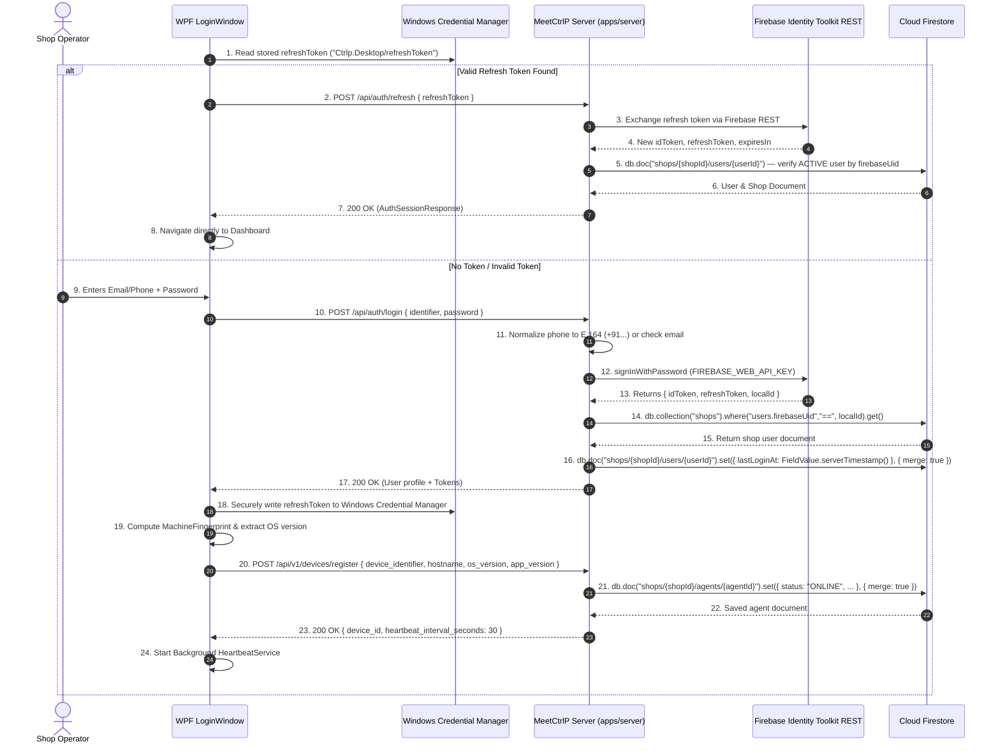

# Section 01: Shop, Account & Device Authentication

## 1. Product Requirements & MVP Scope

Based on `FRD_MVP.md` and `meetctrlp_print_shop_partner_desktop_mvp_requirements.md`:


| Feature                            | Scope  | Rationale / Day-0 Requirement                                                                                    |
| ---------------------------------- | ------ | ---------------------------------------------------------------------------------------------------------------- |
| **Shop Authentication**            | **T0** | The desktop application must securely identify which shop and staff operator it belongs to.                      |
| **Device Registration**            | **T0** | The desktop computer acts as a trusted local print controller. The backend must authorize the physical machine.  |
| **Sign Out**                       | **T0** | Mandatory for security on shared shop hardware (staff shifts, closing time). Clears tokens and in-memory caches. |
| **Device Status (Online/Offline)** | **T0** | Realtime visibility of machine connectivity. Enables backend to avoid routing orders to dead devices.            |
| **Print Agent Version**            | **T0** | Critical compatibility check. If local agent and cloud schema diverge, physical printing fails.                  |
| **Application Version**            | **T1** | Displayed in Settings/Footer for diagnostics, support tickets, and update notifications.                         |
| **Shop Profile Management**        | **T1** | Core shop name and address are read-only on desktop; deep profile editing is handled via web dashboard.          |
| **Multi-Staff Account Management** | **T1** | Owner can see active staff; role switching / permission grants are managed via web portal.                       |


---


## 2. Data Points & Storage Matrix (Firebase vs Cloud Firestore vs Client)

Authentication and device telemetry are split between Firebase Authentication, Cloud Firestore, and local Windows storage:


| Data Point                       | Origin / Capture Source                           | Client Capture Method             | Transport / DTO Format                | Destination Storage | Storage Format & Constraints                                       |
| -------------------------------- | ------------------------------------------------- | --------------------------------- | ------------------------------------- | ------------------- | ------------------------------------------------------------------ |
| **Operator Identifier**          | Operator Input                                    | WPF `LoginWindow.xaml` (TextBox)  | JSON `{ identifier: "..." }`          | Transient           | Real email or Indian phone (+91...)                                |
| **Password**                     | Operator Input                                    | WPF `PasswordBox.Password`        | JSON `{ password: "..." }`            | **Firebase Auth**   | Bcrypt hash inside Firebase Auth (never stored in Firestore)       |
| **Internal Phone Email**         | Generated on Backend                              | `phoneToFirebaseEmail(+91...)`    | Internal Server Only                  | **Firebase Auth**   | `{digits}@phone.meetctrlp.app` (hidden from client)                |
| **Firebase UID (**`localId`**)** | Firebase Identity Toolkit                         | Returned from Firebase REST       | JSON `{ localId: "..." }`             | **Cloud Firestore** | `shops/{shopId}/users/{userId}.firebaseUid` (indexed join key)     |
| **ID Token (JWT)**               | Firebase Identity Toolkit                         | Returned from `apps/server`       | JSON `{ idToken: "..." }`             | Client Memory       | Kept strictly in RAM; 1-hour expiration                            |
| **Refresh Token**                | Firebase Identity Toolkit                         | Returned from `apps/server`       | JSON `{ refreshToken: "..."}`         | Client Local        | Windows Credential Manager / DPAPI (`Ctrlp.Desktop/refreshToken`)  |
| **Staff Profile (Name, Role)**   | Cloud Firestore (`shops/{shopId}/users/{userId}`) | Loaded from `GET /api/auth/me`    | JSON `{ user: { role, name } }`       | Client RAM          | Bound to UI Top Bar (`AuthSession.User`)                           |
| **Machine Fingerprint**          | Windows Host Machine                              | `Registry: MachineGuid` + MAC     | JSON `{ device_identifier }`          | **Cloud Firestore** | `shops/{shopId}/agents/{agentId}.deviceIdentifier` (unique string) |
| **Host System Metadata**         | Windows OS Environment                            | `Environment.OSVersion`, Hostname | JSON `{ os_version, hostname }`       | **Cloud Firestore** | `shops/{shopId}/agents/{agentId}.osVersion`, `.hostname`           |
| **Agent / App Versions**         | Assembly Metadata                                 | `Assembly.GetExecutingAssembly()` | JSON `{ app_version, agent_version }` | **Cloud Firestore** | `shops/{shopId}/agents/{agentId}.appVersion`, `.agentVersion`      |
| **Heartbeat Ping**               | Background Worker                                 | Polled every 30 seconds           | JSON `{ agent_id, status }`           | **Cloud Firestore** | `shops/{shopId}/agents/{agentId}.lastSeenAt`, `.status = 'ONLINE'` |


---


## 3. End-to-End Authentication & Registration Data Flow


```mermaid
sequenceDiagram
    autonumber
    actor Operator as Shop Operator
    participant UI as WPF LoginWindow
    participant Cred as Windows Credential Manager
    participant Server as MeetCtrlP Server (apps/server)
    participant FB as Firebase Identity Toolkit REST
    participant FS as Cloud Firestore

    %% 1. Startup check
    UI->>Cred: 1. Read stored refreshToken ("Ctrlp.Desktop/refreshToken")
    alt Valid Refresh Token Found
        UI->>Server: 2. POST /api/auth/refresh { refreshToken }
        Server->>FB: 3. Exchange refresh token via Firebase REST
        FB-->>Server: 4. New idToken, refreshToken, expiresIn
        Server->>FS: 5. db.doc("shops/{shopId}/users/{userId}") — verify ACTIVE user by firebaseUid
        FS-->>Server: 6. User & Shop Document
        Server-->>UI: 7. 200 OK (AuthSessionResponse)
        UI->>UI: 8. Navigate directly to Dashboard
    else No Token / Invalid Token
        %% 2. Explicit Login
        Operator->>UI: 9. Enters Email/Phone + Password
        UI->>Server: 10. POST /api/auth/login { identifier, password }
        Server->>Server: 11. Normalize phone to E.164 (+91...) or check email
        Server->>FB: 12. signInWithPassword (FIREBASE_WEB_API_KEY)
        FB-->>Server: 13. Returns { idToken, refreshToken, localId }
        Server->>FS: 14. db.collection("shops").where("users.firebaseUid","==", localId).get()
        FS-->>Server: 15. Return shop user document
        Server->>FS: 16. db.doc("shops/{shopId}/users/{userId}").set({ lastLoginAt: FieldValue.serverTimestamp() }, { merge: true })
        Server-->>UI: 17. 200 OK (User profile + Tokens)
        UI->>Cred: 18. Securely write refreshToken to Windows Credential Manager

        %% 3. Device Registration
        UI->>UI: 19. Compute MachineFingerprint & extract OS version
        UI->>Server: 20. POST /api/v1/devices/register { device_identifier, hostname, os_version, app_version }
        Server->>FS: 21. db.doc("shops/{shopId}/agents/{agentId}").set({ status: "ONLINE", ... }, { merge: true })
        FS-->>Server: 22. Saved agent document
        Server-->>UI: 23. 200 OK { device_id, heartbeat_interval_seconds: 30 }
        UI->>UI: 24. Start Background HeartbeatService
    end
```


---


## 4. Technical Build Specification


### 4.1 Client Security: Zero Firebase SDK in Desktop App

- The WPF application **contains zero Firebase dependencies**.
- It communicates solely with `apps/server` using standard typed HTTP clients (`AuthApiClient.cs`).
- Bearer tokens are attached to API requests: `Authorization: Bearer <idToken>`.


### 4.2 Windows Credential Manager & DPAPI Storage

- When tokens are received by the desktop:
  ```csharp
  // Secure persistence via Windows Credential Manager / DPAPI
  public void SaveRefreshToken(string refreshToken)
  {
      byte[] plainBytes = Encoding.UTF8.GetBytes(refreshToken);
      byte[] encryptedBytes = ProtectedData.Protect(
          plainBytes, 
          optionalEntropy: null, 
          DataProtectionScope.CurrentUser
      );
      File.WriteAllBytes(Path.Combine(AppDataPath, "auth.dat"), encryptedBytes);
  }
  ```


### 4.3 Heartbeat & Liveness Protocol

- `HeartbeatService` triggers a tick every 30 seconds.
- Gathers client runtime telemetry:
  - Memory usage (`Process.GetCurrentProcess().WorkingSet64`)
  - Active spooler queue job count
  - Online printer count
- Calls `POST /api/v1/devices/heartbeat` with bearer token.
- Server updates `shops/{shopId}/agents/{agentId}.lastSeenAt` and `.status = 'ONLINE'` via Firestore.

---


## 5. Screen UI & Interaction Design

- **Login Window (**`LoginWindow.xaml`**):**
  - Flat paper-white container (`#FFFFFF`), 12px corner radius, 1px slate border (`#E2E8F0`).
  - Input: Phone or Email (`identifier`).
  - Input: Password (`password`).
  - Action: Primary Green Button `Sign In to Print Shop`.
- **Top Navigation Bar (**`ShellWindow.xaml`**):**
  - Bound to `AuthSession.User.Name` and `AuthSession.User.Role`.
  - Live Connectivity Pill: Green dot for `Connected`, Amber for `Reconnecting`, Red for `Offline`.
  - Machine Badge: `Counter PC 1 (v1.0.0)`.

---


## 6. Firestore Collection Blueprint

```typescript
import { getFirebaseFirestore } from "@ctrlp/firebase";
import { FieldValue, Timestamp } from "firebase-admin/firestore";

const db = getFirebaseFirestore();

// ------------------------------------------------------------
// UPSERT a print agent document into /shops/{shopId}/agents/{agentId}
// Called by POST /api/v1/devices/register
// ------------------------------------------------------------
async function upsertPrintAgent(
  shopId: string,
  agentId: string,
  payload: {
    deviceIdentifier: string;
    hostname: string;
    osVersion: string;
    appVersion: string;
    agentVersion: string;
    registeredByUserId: string;
    heartbeatIntervalSeconds?: number;
  }
): Promise<void> {
  const agentRef = db.doc(`shops/${shopId}/agents/${agentId}`);

  await agentRef.set(
    {
      deviceIdentifier: payload.deviceIdentifier,   // unique fingerprint (MachineGuid + MAC)
      hostname: payload.hostname,                    // e.g. "COUNTER-PC-1"
      osVersion: payload.osVersion,                 // e.g. "Windows 11 (10.0.22621)"
      appVersion: payload.appVersion,               // e.g. "1.0.0"
      agentVersion: payload.agentVersion,           // e.g. "1.0.0"
      registeredByUserId: payload.registeredByUserId,
      heartbeatIntervalSeconds: payload.heartbeatIntervalSeconds ?? 30,
      status: "ONLINE",                             // 'ONLINE' | 'OFFLINE'
      apiKeyHash: null,                             // populated when API key is issued
      lastSeenAt: FieldValue.serverTimestamp(),
      registeredAt: FieldValue.serverTimestamp(),
      updatedAt: FieldValue.serverTimestamp(),
    },
    { merge: true } // UPSERT: preserves existing fields not in this payload
  );
}

// ------------------------------------------------------------
// Heartbeat update — called every 30 s by POST /api/v1/devices/heartbeat
// Only touches liveness fields; does not overwrite registration data
// ------------------------------------------------------------
async function updateAgentHeartbeat(
  shopId: string,
  agentId: string
): Promise<void> {
  const agentRef = db.doc(`shops/${shopId}/agents/${agentId}`);

  await agentRef.set(
    {
      status: "ONLINE",
      lastSeenAt: FieldValue.serverTimestamp(),
    },
    { merge: true }
  );
}

// ------------------------------------------------------------
// Realtime listener — backend monitors agent liveness
// Agents whose lastSeenAt > 90 s ago are considered OFFLINE
// ------------------------------------------------------------
function watchShopAgents(shopId: string): void {
  db.collection(`shops/${shopId}/agents`)
    .where("status", "==", "ONLINE")
    .onSnapshot((snapshot) => {
      snapshot.docChanges().forEach((change) => {
        const agent = change.doc.data();
        console.log(`Agent ${agent.hostname} changed: ${change.type}`);
      });
    });
}
```

> **Firestore path reference:**
>
> - Agent document → `/shops/{shopId}/agents/{agentId}`
> - Key fields: `deviceIdentifier` (unique), `status`, `lastSeenAt`, `hostname`, `osVersion`, `appVersion`, `agentVersion`
> - Liveness index equivalent: query `agents` collection filtered by `status == 'ONLINE'` and ordered by `lastSeenAt DESC`

---


## 7. Developer log

Phase 01, 27 Sep 2026.

### Built

- Desktop sign-in still goes through `apps/server` with no Firebase SDK. The sign-in button label is **Sign In to Print Shop**. A stored refresh token still restores the session.
- After sign-in or restore, the desktop registers this PC with `POST /api/v1/devices/register` and heartbeats every 30 seconds with `POST /api/v1/devices/heartbeat`.
- The fingerprint is SHA-256 of Windows `MachineGuid` plus the first active MAC address. The same shop and PC always get the same Firestore agent id.
- Agent documents are written to `shops/{shopId}/agents/{agentId}` with hostname, OS version, app version `1.0.0`, agent version `1.0.0`, status, and `lastSeenAt`. Heartbeats also store working-set memory, spooler job count, and online printer count.
- Sign out and closing the app call `POST /api/v1/devices/offline`. Sign out still revokes the Firebase refresh token and deletes the Windows Credential Manager entry. Closing the window keeps the refresh token.
- The capabilities window shows the operator name and role, a connectivity pill (Connected / Reconnecting / Offline), the machine badge `HOSTNAME (v1.0.0)`, a read-only shop card, the active staff list, and the app version in the footer.
- Shop profile and staff are `GET /api/v1/shops/profile` and `GET /api/v1/shops/staff`.


### Decisions

- Firestore is the only application database. Register writes `shops/{shopId}` and `shops/{shopId}/users/{userId}`. Staff and shop profile are read from those documents. Postgres is not used by the server.
- Refresh tokens stay in Windows Credential Manager (`CredWrite` target `Ctrlp.Desktop/refreshToken`). That is the DPAPI-backed store named in the spec. A separate `auth.dat` file was not added.
- This build is one process, so `agentVersion` and `appVersion` are both the desktop assembly version `1.0.0`.
- The shared palette has no amber token. Connected uses ecto green, Reconnecting uses macaw blue, Offline uses the existing danger red.
- Shop address is returned as `null`. The Postgres `shops` row has no address columns yet, and profile editing belongs on the web dashboard.
- Any active shop user can read their own shop's staff list. Role grants stay on the web portal.
- There is no Cloud Function sweeper. Each heartbeat marks other agents on that shop `OFFLINE` when `lastSeenAt` is older than 90 seconds. A clean sign-out or process exit marks this agent offline immediately.
- A failed device registration still opens the capabilities window so the operator can see the offline reason and sign out. The pill stays Offline until register succeeds.


### Test cases

Run the server first (`pnpm run server:dev` from the repo, with `apps/server/.env.local` containing `FIREBASE_WEB_API_KEY` and `FIREBASE_SERVICE_ACCOUNT_BASE64`). Postgres is not required. Then from `apps/desktop-proto`:

```powershell
dotnet build .\Ctrlp.Desktop.sln -c Debug
dotnet run --project .\src\Ctrlp.Desktop\Ctrlp.Desktop.csproj -c Debug
```

`src/Ctrlp.Desktop/appsettings.json` must point `ServerBaseUrl` at that server (default `http://localhost:3000`).


| #   | Case                                                                             | Pass when                                                                                                                                                                       |
| --- | -------------------------------------------------------------------------------- | ------------------------------------------------------------------------------------------------------------------------------------------------------------------------------- |
| 1   | Cold start with no saved session                                                 | Login window opens. Button reads **Sign In to Print Shop**.                                                                                                                     |
| 2   | Sign in with a known shop email or `+91` phone and password                      | Capabilities window opens. Header shows `Name · ROLE`.                                                                                                                          |
| 3   | Wrong password                                                                   | Login stays open and shows the server error.                                                                                                                                    |
| 4   | After a successful sign-in                                                       | Pill turns **Connected** (green). Badge shows this PC name and `(v1.0.0)`. Shop card shows the shop name and status. Staff card lists the owner. Footer shows `CtrlP 1.0.0`.    |
| 5   | Firestore shop, staff, and agent                                                 | `shops/{shopId}` and `shops/{shopId}/users/{userId}` exist for the signed-in owner. `shops/{shopId}/agents/{agentId}` is `ONLINE` and has this hostname and `deviceIdentifier`. |
| 6   | Wait at least 35 seconds                                                         | `lastSeenAt` moves forward. Document also has `memoryWorkingSetBytes`, `spoolerJobCount`, and `onlinePrinterCount`.                                                             |
| 7   | Stop the server, wait for the next heartbeat                                     | Pill turns **Reconnecting** (blue) and shows a reachability message. Start the server again and the following heartbeat returns **Connected**.                                  |
| 8   | Sign out                                                                         | Login window returns. Credential Manager no longer has `Ctrlp.Desktop/refreshToken`. Agent `status` is `OFFLINE`.                                                               |
| 9   | Sign in again, then close the window with the X button                           | Agent becomes `OFFLINE`. Reopen the app and it restores the session without asking for the password, then returns to **Connected**.                                             |
| 10  | `GET /api/v1/shops/profile` and `GET /api/v1/shops/staff` without a bearer token | Both return 401. With the ID token they return only that shop.                                                                                                                  |
| 11  | `POST /api/v1/devices/heartbeat` with an unknown `deviceId`                      | Returns 404 `device is not registered`.                                                                                                                                         |
| 12  | Second sign-in on the same PC and shop                                           | The same `deviceId` is reused (upsert), and `createdAt` from the first registration is still present.                                                                           |


### Update — Firestore only

Shop registration and staff no longer use Postgres. `POST /api/auth/register` writes `shops/{shopId}`, `shops/{shopId}/users/{userId}`, and `authLookups/{hash}` for the Firebase uid, phone, and email. Those lookup documents are direct reads, so registration does not need a collection-group index. Profile and staff read the shop documents. ### Update — Tauri Print Shop desktop (28 Sep 2026)

The current shop desktop (`apps/print-shop` + `apps/print-agent`) now uses the same Firebase Auth + Firestore path as this spec. There is still no Firebase SDK in the desktop app. Login and register call `apps/server`. Phone + password does not use OTP. Refresh tokens are stored in Windows Credential Manager as `Ctrlp.PrintShop/refreshToken`. Device documents remain `shops/{shopId}/agents/{agentId}` with `id`, `shopId`, `name`, `deviceIdentifier`, heartbeat fields, and status.