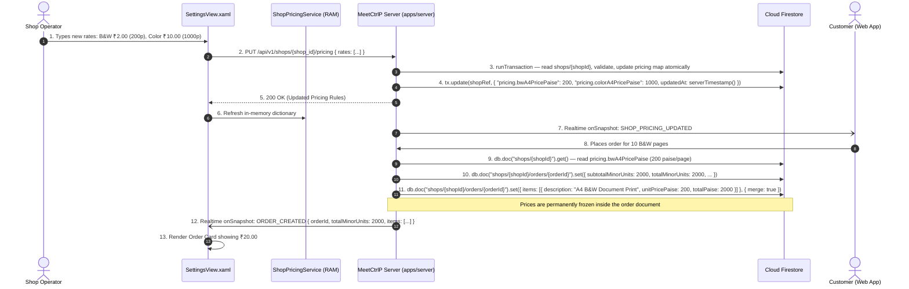

# Section 02: Shop Configuration, Capabilities & Pricing Engine

## 1. Product Requirements & MVP Scope

Based on `FRD_MVP.md` and `meetctrlp_print_shop_partner_desktop_mvp_requirements.md`:

| Feature | Scope | Rationale / Day-0 Requirement |
|---------|-------|-------------------------------|
| **B&W Page Pricing** | **T0** | Foundational requirement. Price per single-sided page in INR paise. |
| **Color Page Pricing** | **T0** | Foundational requirement for color print fulfillment. |
| **Paper Size Pricing** | **T0** | A4 is the standard baseline; A3 supported if shop offers large-format prints. |
| **Shop Capabilities** | **T0** | Determines whether customer web app permits placing color or specific paper-size orders for this shop. |
| **Pricing Modification UI** | **T0** | Operator must be able to view and adjust per-page rates directly from Screen 6 (Settings). |
| **Service Configuration** | **T1** | Simplified for MVP to single core service: `DOCUMENT_PRINT`. Extended binding/lamination services deferred. |
| **Shop Business Hours** | **T1** | Standard opening/closing hours stored in cloud; warning displayed if order arrives outside operating hours. |

---

## 2. Data Points & Storage Matrix (Cloud Firestore vs Client-Side Cache)

All financial rates, unit configurations, and capability flags are stored exclusively in **Cloud Firestore** and cached in desktop client RAM:

| Data Point | Origin / Capture Source | Client Capture Method | Transport / DTO Format | Destination Storage | Storage Format & Constraints |
| :--- | :--- | :--- | :--- | :--- | :--- |
| **B&W A4 Rate (Paise)** | Operator Input / Admin | WPF `SettingsView.xaml` (TextBox) | JSON `{ bw_a4_price_paise: 200 }` | **Cloud Firestore** | `shops/{shopId}.pricing.bwA4PricePaise` (`number` ≥ 0, integer paise) |
| **Color A4 Rate (Paise)**| Operator Input / Admin | WPF `SettingsView.xaml` (TextBox) | JSON `{ color_a4_price_paise: 1000 }` | **Cloud Firestore** | `shops/{shopId}.pricing.colorA4PricePaise` (`number` ≥ 0, integer paise) |
| **Color A3 Rate (Paise)**| Operator Input / Admin | WPF `SettingsView.xaml` (TextBox) | JSON `{ color_a3_price_paise: 2500 }` | **Cloud Firestore** | `shops/{shopId}.pricing.colorA3PricePaise` (`number` ≥ 0, integer paise) |
| **Currency Code** | Platform Default | Hardcoded | JSON `{ currency: "INR" }` | **Cloud Firestore** | `shops/{shopId}.pricing.currency` (`string` = `"INR"`) |
| **B&W Capability Flag** | Hardware / Operator | Auto-detected / Toggle | JSON `{ bw_printing: true }` | **Cloud Firestore** | `shops/{shopId}.capabilities.bwPrinting` (`boolean`) |
| **Color Capability Flag**| Hardware / Operator | Auto-detected / Toggle | JSON `{ color_printing: true }` | **Cloud Firestore** | `shops/{shopId}.capabilities.colorPrinting` (`boolean`) |
| **A3 Capability Flag** | Hardware / Operator | Auto-detected / Toggle | JSON `{ a3_printing: false }` | **Cloud Firestore** | `shops/{shopId}.capabilities.a3Printing` (`boolean`) |
| **Day of Week Schedule**| Operator / Admin | Settings Dropdown | JSON `{ day_of_week, opens_at, closes_at }` | **Cloud Firestore** | `shops/{shopId}.businessHours` (array of `{ dayOfWeek: 0–6, opensAt: string, closesAt: string }`) |
| **Local Pricing Cache** | Server Fetch | `GET /api/v1/shops/{id}/pricing` | In-Memory C# Object | Client RAM | `ShopPricingService._activeRates` dictionary |

---

## 3. End-to-End Pricing & Configuration Data Flow



---

## 4. Technical Build Specification

### 4.1 Minor Units (Paise) Integer Math
All calculations in C# and TypeScript use integer minor units to eliminate IEEE 754 floating-point errors:
```csharp
public class PricingCalculator
{
    public static long CalculateDocumentTotalPaise(int billablePages, int copies, long unitPricePaise)
    {
        if (billablePages <= 0) throw new ArgumentException("Page count must be positive.");
        if (copies <= 0) throw new ArgumentException("Copies must be positive.");
        if (unitPricePaise < 0) throw new ArgumentException("Unit price cannot be negative.");

        return checked(billablePages * copies * unitPricePaise);
    }
}
```

### 4.2 The Immutable Snapshot Rule
- When an order is placed, the prices are read from `shops/{shopId}.pricing` and copied into `shops/{shopId}/orders/{orderId}`.
- If the shop operator later changes B&W printing from ₹2.00 to ₹3.00:
  - Existing orders in `SUBMITTED`, `SHOP_ACCEPTED`, `PRINTING`, or `READY` retain their original ₹2.00 per-page rate frozen in the order document.
  - Future orders will be calculated under the new ₹3.00 rate.

---

## 5. Screen UI & Settings Interaction

In **Screen 6: Shop & Settings**:
- **Pricing Card (12px Radius, Paper-White):**
  - Input field: B&W Price per A4 page ($₹ / \text{page}$).
  - Input field: Color Price per A4 page ($₹ / \text{page}$).
  - Input field: Color Price per A3 page ($₹ / \text{page}$).
  - Live Validation: Minimum ₹0.50 (50 paise), maximum ₹100.00. Numeric-only formatting with currency prefix.
- **Capability Toggles:**
  - Switch: *Offer Color Printing* (if enabled, customer web app allows color mode selection).
  - Switch: *Offer A3 Printing*.
- **Save Changes Button:**
  - Primary Green Action (`#16A34A`), 12px radius, displays optimistic loader spinner while saving.

---

## 6. Firestore Collection Blueprint

```typescript
import { getFirebaseFirestore } from "@ctrlp/firebase";
import { FieldValue, Timestamp } from "firebase-admin/firestore";

const db = getFirebaseFirestore();

// ------------------------------------------------------------
// Pricing & capabilities are embedded maps inside /shops/{shopId}
//
// shops/{shopId} document shape (pricing & capabilities subset):
// {
//   pricing: {
//     currency: "INR",
//     bwA4PricePaise: number,      // e.g. 200  (integer minor units ≥ 0)
//     colorA4PricePaise: number,   // e.g. 1000
//     colorA3PricePaise: number,   // e.g. 2500
//     updatedAt: Timestamp,
//   },
//   capabilities: {
//     bwPrinting: boolean,         // always true for MVP
//     colorPrinting: boolean,
//     a4Printing: boolean,
//     a3Printing: boolean,
//   },
//   businessHours: Array<{
//     dayOfWeek: number,           // 0 = Sunday … 6 = Saturday
//     opensAt: string,             // "09:00"
//     closesAt: string,            // "21:00"
//   }>,
// }
// ------------------------------------------------------------

// ------------------------------------------------------------
// ATOMIC PRICING UPDATE via runTransaction
// Called by PUT /api/v1/shops/{shopId}/pricing
// ------------------------------------------------------------
async function updateShopPricing(
  shopId: string,
  rates: {
    bwA4PricePaise: number;
    colorA4PricePaise: number;
    colorA3PricePaise: number;
  }
): Promise<void> {
  const shopRef = db.doc(`shops/${shopId}`);

  await db.runTransaction(async (tx) => {
    const shopDoc = await tx.get(shopRef);

    if (!shopDoc.exists) {
      throw new Error(`Shop ${shopId} not found`);
    }

    // Validate: all rates must be non-negative integers
    for (const [key, value] of Object.entries(rates)) {
      if (!Number.isInteger(value) || value < 0) {
        throw new Error(`Rate "${key}" must be a non-negative integer (paise).`);
      }
    }

    // Atomically overwrite the embedded pricing map
    tx.update(shopRef, {
      "pricing.bwA4PricePaise": rates.bwA4PricePaise,
      "pricing.colorA4PricePaise": rates.colorA4PricePaise,
      "pricing.colorA3PricePaise": rates.colorA3PricePaise,
      "pricing.currency": "INR",
      "pricing.updatedAt": FieldValue.serverTimestamp(),
      updatedAt: FieldValue.serverTimestamp(),
    });
  });
}

// ------------------------------------------------------------
// ATOMIC CAPABILITIES UPDATE via runTransaction
// Called by PUT /api/v1/shops/{shopId}/capabilities
// ------------------------------------------------------------
async function updateShopCapabilities(
  shopId: string,
  capabilities: {
    bwPrinting: boolean;
    colorPrinting: boolean;
    a4Printing: boolean;
    a3Printing: boolean;
  }
): Promise<void> {
  const shopRef = db.doc(`shops/${shopId}`);

  await db.runTransaction(async (tx) => {
    const shopDoc = await tx.get(shopRef);

    if (!shopDoc.exists) {
      throw new Error(`Shop ${shopId} not found`);
    }

    tx.update(shopRef, {
      "capabilities.bwPrinting": capabilities.bwPrinting,
      "capabilities.colorPrinting": capabilities.colorPrinting,
      "capabilities.a4Printing": capabilities.a4Printing,
      "capabilities.a3Printing": capabilities.a3Printing,
      updatedAt: FieldValue.serverTimestamp(),
    });
  });
}

// ------------------------------------------------------------
// REALTIME PRICING LISTENER — desktop app subscribes on login
// Keeps ShopPricingService._activeRates in sync without polling
// ------------------------------------------------------------
function watchShopPricing(
  shopId: string,
  onUpdate: (pricing: Record<string, unknown>) => void
): () => void {
  const shopRef = db.doc(`shops/${shopId}`);

  const unsubscribe = shopRef.onSnapshot((snapshot) => {
    if (!snapshot.exists) return;

    const data = snapshot.data();
    if (data?.pricing) {
      onUpdate(data.pricing as Record<string, unknown>);
    }
  });

  // Return unsubscribe function so caller can clean up
  return unsubscribe;
}

// ------------------------------------------------------------
// READ active pricing once — used during order placement
// to freeze prices into the order document
// ------------------------------------------------------------
async function getActivePricing(shopId: string): Promise<{
  bwA4PricePaise: number;
  colorA4PricePaise: number;
  colorA3PricePaise: number;
  currency: string;
}> {
  const shopDoc = await db.doc(`shops/${shopId}`).get();

  if (!shopDoc.exists) {
    throw new Error(`Shop ${shopId} not found`);
  }

  const { pricing } = shopDoc.data() as { pricing: Record<string, unknown> };
  return {
    bwA4PricePaise: pricing.bwA4PricePaise as number,
    colorA4PricePaise: pricing.colorA4PricePaise as number,
    colorA3PricePaise: pricing.colorA3PricePaise as number,
    currency: (pricing.currency as string) ?? "INR",
  };
}
```

> **Firestore path reference:**
> - Shop document (with embedded pricing) → `/shops/{shopId}`
> - Pricing fields: `pricing.bwA4PricePaise`, `pricing.colorA4PricePaise`, `pricing.colorA3PricePaise`, `pricing.currency`, `pricing.updatedAt`
> - Capabilities fields: `capabilities.bwPrinting`, `capabilities.colorPrinting`, `capabilities.a4Printing`, `capabilities.a3Printing`
> - All monetary values stored as `number` (integer paise / minor units, ≥ 0) — equivalent to the former `BIGINT` constraint
> - Prices are frozen into `shops/{shopId}/orders/{orderId}` at order-creation time to satisfy the Immutable Snapshot Rule
