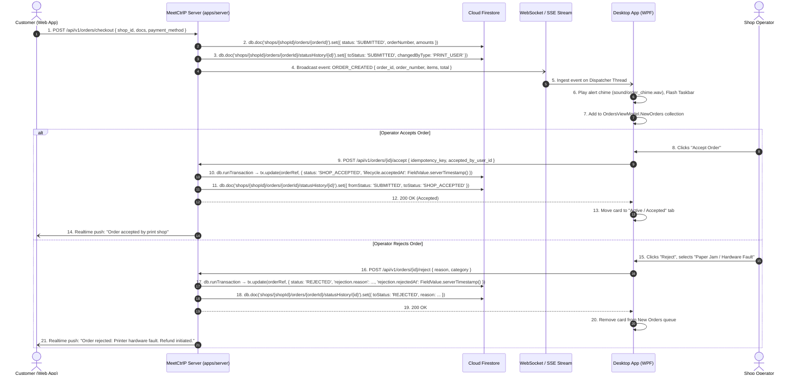

# Section 03: Order Lifecycle, Queues & State Machine

## 1. Product Requirements & MVP Scope

Based on `FRD_MVP.md` and `meetctrlp_print_shop_partner_desktop_mvp_requirements.md`:

| Feature | Scope | Rationale / Day-0 Requirement |
|---------|-------|-------------------------------|
| **New Orders Reception** | **T0** | Realtime arrival of customer orders with audio/visual notification. |
| **Order Acceptance** | **T0** | Shop commits to printing the order. Transitions state to `SHOP_ACCEPTED`. |
| **Order Rejection** | **T0** | Operator can safely reject order with a structured reason (e.g. out of paper, invalid document). |
| **Active / Printing Orders** | **T0** | Tracks orders actively spooling or executing physical print jobs. |
| **Ready for Pickup** | **T0** | Indicates physical print is completed and waiting on counter for customer pickup. |
| **Completed Orders** | **T0** | Order handed over and paid (if cash). Formal operational closure. |
| **Order Details Screen** | **T0** | Full breakdown: documents, pages, copies, color mode, payment status, subtotal. |
| **Order ID / Search** | **T0** | Fast lookup by order number or customer phone. |
| **Advanced Multi-Criteria Filters** | **T1** | Basic status tabs (New, Active, Ready, Completed) suffice for MVP. Complex date-range filters deferred. |

---

## 2. Data Points & Storage Matrix (Cloud Firestore vs Client-Side Observable State)

All order business records and lifecycle transitions are persisted in **Cloud Firestore** and mirrored into the desktop client's reactive view models:

| Data Point | Origin / Capture Source | Client Capture Method | Transport / DTO Format | Destination Storage | Storage Format & Constraints |
| :--- | :--- | :--- | :--- | :--- | :--- |
| **Order Number** | Cloud Backend Sequence | Generated on Order Creation | JSON `{ order_number: "ORD-8821" }` | **Cloud Firestore** | `orders/{orderId}.orderNumber` (`string`, unique) |
| **Customer Session Ref**| Web App Guest User | Created on QR Scan | JSON `{ print_user_id: "uuid" }` | **Cloud Firestore** | `orders/{orderId}.printUserId` (ref → `/printUsers/{printUserId}`) |
| **Order Status** | Cloud / Operator Action | WebSocket Event / REST DTO | JSON `{ status: "SUBMITTED" }` | **Cloud Firestore** | `orders/{orderId}.status` (`string` ENUM) |
| **Subtotal & Total Paise**| Pricing Engine | Computed from frozen items | JSON `{ total_minor_units: 4500 }` | **Cloud Firestore** | `orders/{orderId}.amounts.totalMinorUnits` (`number` ≥ 0, integer paise) |
| **Pickup Code** | Cloud Backend | 4-Digit Code Generator | JSON `{ pickup_code: "8821" }` | **Cloud Firestore** | `orders/{orderId}.pickupCode` (`string`) |
| **Rejection Reason** | Operator Input | WPF `RejectModal.xaml` (ComboBox) | JSON `{ reason, category }` | **Cloud Firestore** | `orders/{orderId}.rejection.reason`, `orders/{orderId}.rejection.category` |
| **Accepted By Staff** | Current Desktop Session | Extracted from `AuthSession.User.Id` | JSON `{ accepted_by_user_id: "uuid" }`| **Cloud Firestore** | `orders/{orderId}.lifecycle.acceptedByUserId` (`string`) |
| **Completed By Staff** | Current Desktop Session | Extracted from `AuthSession.User.Id` | JSON `{ completed_by_user_id: "uuid" }`| **Cloud Firestore** | `orders/{orderId}.lifecycle.completedByUserId` (`string`) |
| **State History Trail** | System Automation | Logged on every transition | Internal Trigger / Service | **Cloud Firestore** | `/shops/{shopId}/orders/{orderId}/statusHistory/{historyId}` (`fromStatus`, `toStatus`) |
| **Active Queue Collection**| WebSocket Ingestion | `OrdersViewModel.Orders.Add()` | In-Memory `ObservableCollection` | Client RAM | Bound to WPF DataGrid / Card list |

---

## 3. End-to-End Order Lifecycle Data Flow



---

## 4. Technical Build Specification

### 4.1 Reactive WPF Queue Management
Incoming orders and status changes are dispatched directly onto the WPF UI thread:
```csharp
public class OrdersViewModel : ObservableObject
{
    public ObservableCollection<OrderCardViewModel> NewOrders { get; } = new();
    public ObservableCollection<OrderCardViewModel> ActiveOrders { get; } = new();
    public ObservableCollection<OrderCardViewModel> ReadyOrders { get; } = new();
    public ObservableCollection<OrderCardViewModel> CompletedOrders { get; } = new();

    public void OnOrderEventReceived(OrderRealtimeEvent ev)
    {
        App.Current.Dispatcher.Invoke(() =>
        {
            switch (ev.EventType)
            {
                case "ORDER_CREATED":
                    var newOrder = new OrderCardViewModel(ev.Payload);
                    NewOrders.Insert(0, newOrder);
                    SystemSounds.Asterisk.Play(); // Audible alert
                    break;
                case "ORDER_STATUS_CHANGED":
                    TransitionOrderUI(ev.OrderId, ev.NewStatus);
                    break;
            }
        });
    }
}
```

### 4.2 Concurrency & Conflict Prevention
- Every state transition request requires an `idempotency_key` and the client's observed `current_status`.
- If the customer cancels right as the shop accepts:
  - The server uses a Firestore transaction that reads the order document first and checks `doc.data().status === 'SUBMITTED'` before writing.
  - If the status has already changed, the transaction aborts and returns HTTP `409 Conflict` with `{ error: "ORDER_ALREADY_CANCELLED" }`.
  - Desktop client catches 409, removes order from queue, and displays a friendly toast: *"Order was cancelled by customer before acceptance."*

---

## 5. Screen UI & Interaction Design

- **Orders Screen (`OrdersView.xaml`):**
  - Segmented Navigation Tabs:
    - `New Orders (3)` — Highlights attention-needed unaccepted orders.
    - `Active / Printing (2)` — Tracks spooling and printer progress.
    - `Ready for Pickup (5)` — Holds prints stacked on counter.
    - `Completed Today (42)` — Daily archive.
  - Search Input: Fast instant search by Order Number (`ORD-1042`) or Customer Phone.
  - Action Buttons: Flat Green Accept (`#16A34A`), Outline Red Reject (`#DC2626`), both with 12px border radius.

---

## 6. Firestore Collection Blueprint & Constraints

### 6.1 Order Document — `/shops/{shopId}/orders/{orderId}`

```typescript
import { getFirebaseFirestore } from "@ctrlp/firebase";
import { FieldValue, Timestamp } from "firebase-admin/firestore";

const db = getFirebaseFirestore();

// --- Create an order document on checkout ---
await db.doc(`shops/${shopId}/orders/${orderId}`).set({
  // Identity
  orderId,
  orderNumber: "ORD-8821",           // string, unique within shop
  shopId,
  printUserId,                        // ref → /printUsers/{printUserId}

  // Status
  status: "SUBMITTED",               // SUBMITTED | SHOP_ACCEPTED | REJECTED | PRINTING | READY | COMPLETED

  // Pickup
  pickupCode: "8821",                // 4-digit string

  // Embedded amounts (all values in integer paise)
  amounts: {
    subtotalMinorUnits: 4200,        // number, ≥ 0
    totalMinorUnits:   4500,         // number, ≥ 0
    taxMinorUnits:      300,         // number, ≥ 0
  },

  // Lifecycle timestamps & actor refs (populated as order progresses)
  lifecycle: {
    submittedAt:        FieldValue.serverTimestamp(),
    acceptedAt:         null,
    acceptedByUserId:   null,        // → /shops/{shopId}/users/{userId}
    readyAt:            null,
    completedAt:        null,
    completedByUserId:  null,        // → /shops/{shopId}/users/{userId}
  },

  // Rejection info (null unless status === 'REJECTED')
  rejection: {
    rejectedAt:  null,
    reason:      null,               // e.g. "Paper Jam / Hardware Fault"
    category:    null,               // e.g. "HARDWARE_FAULT"
  },

  // Audit
  createdAt: FieldValue.serverTimestamp(),
  updatedAt: FieldValue.serverTimestamp(),
});
```

### 6.2 Status History Sub-collection — `/shops/{shopId}/orders/{orderId}/statusHistory/{historyId}`

```typescript
// Append a history entry whenever status transitions
await db
  .doc(`shops/${shopId}/orders/${orderId}/statusHistory/${historyId}`)
  .set({
    historyId,
    fromStatus:      "SUBMITTED",    // previous status (null for the first entry)
    toStatus:        "SHOP_ACCEPTED",
    changedByType:   "SHOP_USER",    // PRINT_USER | SHOP_USER | SYSTEM
    changedByUserId: acceptedByUserId,
    reason:          null,
    changedAt:       FieldValue.serverTimestamp(),
  });
```

### 6.3 Atomic Status Transition with Conflict Detection

```typescript
import { getFirebaseFirestore } from "@ctrlp/firebase";
import { FieldValue } from "firebase-admin/firestore";

const db = getFirebaseFirestore();

/**
 * Atomically transitions an order from SUBMITTED → SHOP_ACCEPTED.
 * Throws a 409-equivalent error if the order is no longer in SUBMITTED state
 * (e.g. customer cancelled concurrently).
 */
async function acceptOrder(
  shopId: string,
  orderId: string,
  acceptedByUserId: string,
  historyId: string,
): Promise<void> {
  const orderRef   = db.doc(`shops/${shopId}/orders/${orderId}`);
  const historyRef = db.doc(`shops/${shopId}/orders/${orderId}/statusHistory/${historyId}`);

  await db.runTransaction(async (tx) => {
    const orderSnap = await tx.get(orderRef);

    if (!orderSnap.exists) {
      throw Object.assign(new Error("ORDER_NOT_FOUND"), { code: 404 });
    }

    const current = orderSnap.data()!;

    if (current.status !== "SUBMITTED") {
      // Concurrent mutation detected — surface as 409 Conflict to the caller
      throw Object.assign(
        new Error(`ORDER_ALREADY_CANCELLED: current status is '${current.status}'`),
        { code: 409 },
      );
    }

    // 1. Transition the order document
    tx.update(orderRef, {
      status:                     "SHOP_ACCEPTED",
      "lifecycle.acceptedAt":     FieldValue.serverTimestamp(),
      "lifecycle.acceptedByUserId": acceptedByUserId,
      updatedAt:                  FieldValue.serverTimestamp(),
    });

    // 2. Append to statusHistory sub-collection (inside the same transaction)
    tx.set(historyRef, {
      historyId,
      fromStatus:      "SUBMITTED",
      toStatus:        "SHOP_ACCEPTED",
      changedByType:   "SHOP_USER",
      changedByUserId: acceptedByUserId,
      reason:          null,
      changedAt:       FieldValue.serverTimestamp(),
    });
  });
}
```

### 6.4 Realtime Queue Listener (Server-Side / Edge Function)

```typescript
// Listen for all SUBMITTED orders for a given shop in real time
db.collection(`shops/${shopId}/orders`)
  .where("status", "==", "SUBMITTED")
  .orderBy("createdAt", "desc")
  .onSnapshot((snapshot) => {
    snapshot.docChanges().forEach((change) => {
      if (change.type === "added") {
        broadcastOrderCreatedEvent(change.doc.data());
      }
      if (change.type === "modified") {
        broadcastOrderStatusChangedEvent(change.doc.data());
      }
    });
  });
```
