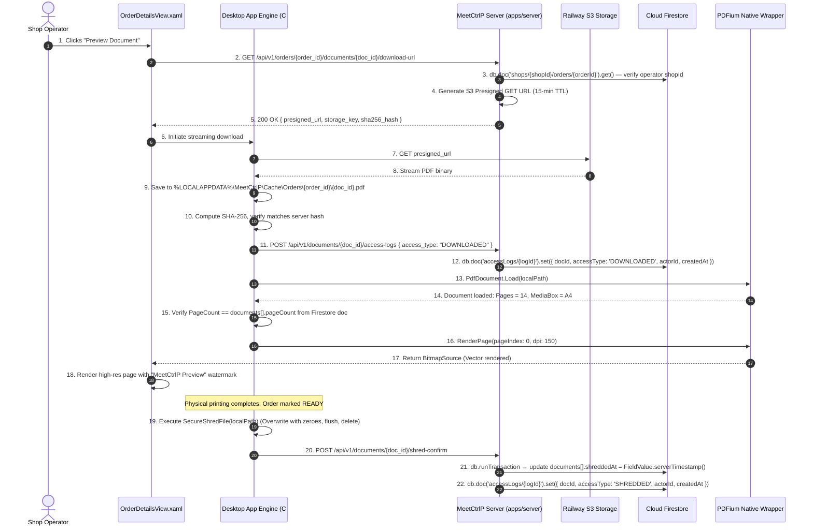

# Section 04: Document Handling, PDF Rendering & Privacy/Shredding

## 1. Product Requirements & MVP Scope

Based on `FRD_MVP.md` and `meetctrlp_print_shop_partner_desktop_mvp_requirements.md`:

| Feature | Scope | Rationale / Day-0 Requirement |
|---------|-------|-------------------------------|
| **Multi-Document Orders** | **T0** | Orders frequently contain 2+ PDF files. Desktop must handle sequence and individual configs. |
| **Filename & Page Count** | **T0** | Page count is non-negotiable for billing verification and printer sheet budgeting. |
| **Document Preview** | **T0** | Operators must inspect documents before printing to prevent misprints or inappropriate content. |
| **Secure Retrieval** | **T0** | Customer files must never be publicly accessible. Presigned URLs with short TTL. |
| **Document & Render Validation** | **T0** | Detect corrupted PDFs before sending to printer to avoid printer hangs. |
| **Temporary Local Storage** | **T0** | Local files required for spooling. Must be stored in isolated sandbox directory. |
| **Secure Shredding / Deletion** | **T0** | Day-0 privacy requirement. Files must be wiped after printing completes. |
| **Document Access Audit Log** | **T0** | Full compliance record of every download, preview, spool, and deletion event. |

---

## 2. Data Points & Storage Matrix (Railway S3 vs Cloud Firestore vs Local Sandbox)

Document binaries live in Railway S3; Cloud Firestore stores metadata, validation checksums, and audit trails; the desktop client maintains an ephemeral sandboxed cache:

| Data Point | Origin / Capture Source | Client Capture Method | Transport / DTO Format | Destination Storage | Storage Format & Constraints |
| :--- | :--- | :--- | :--- | :--- | :--- |
| **Raw PDF Binary** | Customer File Upload | Downloaded via Presigned GET | Binary Stream (`application/pdf`) | **Railway S3 Storage** | `uploads/{shop_id}/{order_id}/{doc_id}.pdf` |
| **S3 Storage Key** | Backend S3 Generator | Presigned URL Generator | JSON `{ storage_key: "uploads/..." }` | **Cloud Firestore** | `orders/{orderId}.documents[].storageKey` (`string`) |
| **Original Filename** | Customer Upload | Form Multipart Header | JSON `{ original_filename: "notes.pdf" }`| **Cloud Firestore** | `orders/{orderId}.documents[].originalFilename` (`string`) |
| **File Size Bytes** | Upload Header / File Info | `FileInfo.Length` / S3 Header | JSON `{ file_size_bytes: 2048576 }` | **Cloud Firestore** | `orders/{orderId}.documents[].fileSizeBytes` (`number` ≥ 0) |
| **Page Count** | PDFium Parser on Client | Extracted from PDF Catalog | JSON `{ page_count: 14 }` | **Cloud Firestore** | `orders/{orderId}.documents[].pageCount` (`number` > 0) |
| **SHA-256 Checksum** | Client Stream Hasher | `SHA256.Create().ComputeHash()` | JSON `{ sha256_hash: "9f86d081..." }` | **Cloud Firestore** | `orders/{orderId}.documents[].sha256Hash` (`string`, 64 chars) |
| **Temporary Cache File** | S3 Download Stream | `FileStream.WriteAsync()` | Binary on Disk | Client Local | `%LOCALAPPDATA%\MeetCtrlP\Cache\Orders\{id}.pdf` |
| **Shredded Timestamp** | Local Shredder Routine | `DateTime.UtcNow` upon wipe | JSON `{ shredded_at: "2026-09-26..." }`| **Cloud Firestore** | `orders/{orderId}.documents[].shreddedAt` (`Timestamp` or `null`) |
| **Document Access Event**| Client Action Trigger | `POST /api/v1/documents/access` | JSON `{ doc_id, access_type: "SHREDDED" }`| **Cloud Firestore** | `/accessLogs/{logId}` (`actorId`, `accessType`) |

---

## 3. End-to-End Document Retrieval, Rendering & Shredding Data Flow



---

## 4. Technical Build Specification

### 4.1 Sandboxed Local File Storage
Files are saved strictly inside the application's isolated local AppData hierarchy:
```text
%LOCALAPPDATA%\MeetCtrlP\Cache\Orders\{order_id}\
    ├── doc_9b1deb4d.pdf
    └── doc_9b1deb4d.pdf.meta
```
- Folder permissions are locked down via `DirectorySecurity` to `WindowsIdentity.GetCurrent()`.
- Windows indexing, thumbnail generation, and recent file lists are disabled for this cache folder.

### 4.2 Cryptographic Zero-Retention Shredder (C# Implementation)
```csharp
public static class DocumentPrivacyService
{
    public static void SecureShredFile(string filePath)
    {
        if (!File.Exists(filePath)) return;

        try
        {
            var fileInfo = new FileInfo(filePath);
            long length = fileInfo.Length;
            byte[] zeroBuffer = new byte[8192];

            // 1. Overwrite file with zeroes
            using (var stream = new FileStream(filePath, FileMode.Open, FileAccess.Write, FileShare.None))
            {
                long written = 0;
                while (written < length)
                {
                    int bytesToWrite = (int)Math.Min(zeroBuffer.Length, length - written);
                    stream.Write(zeroBuffer, 0, bytesToWrite);
                    written += bytesToWrite;
                }
                stream.Flush(flushToDisk: true);
            }

            // 2. Overwrite file timestamps to prevent forensic timeline reconstruction
            File.SetCreationTimeUtc(filePath, new DateTime(2000, 1, 1, 0, 0, 0, DateTimeKind.Utc));
            File.SetLastWriteTimeUtc(filePath, new DateTime(2000, 1, 1, 0, 0, 0, DateTimeKind.Utc));

            // 3. Delete file entry
            File.Delete(filePath);
        }
        catch (Exception ex)
        {
            Log.Error(ex, "Failed to securely shred file {FilePath}", filePath);
        }
    }
}
```

---

## 5. Screen UI & Preview Component

In **Screen 3: Order Details**:
- **Document List Grid:**
  - Thumbnail preview of page 1.
  - Details: Filename (`project_report.pdf`), File Size (`2.4 MB`), Total Pages (`18 pages`).
  - Integrity badge: `Verified (SHA-256 match)`.
  - Preview Button: Opens high-res viewer modal.
- **Preview Modal (`DocumentPreviewModal.xaml`):**
  - Smooth vector rendering powered by PDFium.
  - Top Toolbar: Page jumper (`Page 3 of 18`), Zoom (+ / - / Fit to Width / Fit to Page).
  - Security Watermark: Subtle semi-transparent overlay across page center: *"MeetCtrlP Operator Preview - Confidential"*.

---

## 6. Firestore Collection Blueprint & Constraints

### 6.1 Order Document with Embedded Document Array — `/shops/{shopId}/orders/{orderId}`

Documents are stored as an embedded array within the order document. Each element tracks the full lifecycle of a single PDF file:

```typescript
import { getFirebaseFirestore } from "@ctrlp/firebase";
import { FieldValue, Timestamp } from "firebase-admin/firestore";

const db = getFirebaseFirestore();

// --- Embed document metadata when order is created ---
await db.doc(`shops/${shopId}/orders/${orderId}`).set({
  // ... other order fields (status, amounts, lifecycle, etc.) ...

  // Embedded array of document records
  documents: [
    {
      docId:            "doc_9b1deb4d",
      storageKey:       "uploads/{shopId}/{orderId}/doc_9b1deb4d.pdf", // string
      originalFilename: "notes.pdf",           // string
      fileSizeBytes:    2048576,               // number, ≥ 0
      pageCount:        14,                    // number, > 0
      sha256Hash:       "9f86d081...",         // string, 64 hex chars
      localDownloadedAt: null,                 // Timestamp | null
      shreddedAt:        null,                 // Timestamp | null — set by shred-confirm
    },
    // ... additional document entries ...
  ],

  createdAt: FieldValue.serverTimestamp(),
  updatedAt: FieldValue.serverTimestamp(),
}, { merge: true });
```

### 6.2 Updating `shreddedAt` on a Specific Embedded Document

Because `documents` is an embedded array indexed by `docId`, the shred-confirm handler uses a transaction to locate and update the correct element:

```typescript
import { getFirebaseFirestore } from "@ctrlp/firebase";
import { FieldValue } from "firebase-admin/firestore";

const db = getFirebaseFirestore();

/**
 * Marks a specific document entry as shredded within the order's
 * embedded `documents[]` array.
 */
async function confirmDocumentShredded(
  shopId: string,
  orderId: string,
  docId: string,
): Promise<void> {
  const orderRef = db.doc(`shops/${shopId}/orders/${orderId}`);

  await db.runTransaction(async (tx) => {
    const snap = await tx.get(orderRef);

    if (!snap.exists) {
      throw Object.assign(new Error("ORDER_NOT_FOUND"), { code: 404 });
    }

    const data = snap.data()!;
    const documents: any[] = data.documents ?? [];

    const idx = documents.findIndex((d) => d.docId === docId);
    if (idx === -1) {
      throw Object.assign(new Error("DOCUMENT_NOT_FOUND"), { code: 404 });
    }

    // Patch only the target element; leave all others untouched
    documents[idx] = {
      ...documents[idx],
      shreddedAt: FieldValue.serverTimestamp(),
    };

    tx.update(orderRef, {
      documents,
      updatedAt: FieldValue.serverTimestamp(),
    });
  });
}
```

### 6.3 Document Access Audit Log — `/accessLogs/{logId}`

Every download, preview, spool, and deletion event is written as a top-level document for compliance:

```typescript
import { getFirebaseFirestore } from "@ctrlp/firebase";
import { FieldValue } from "firebase-admin/firestore";

const db = getFirebaseFirestore();

/**
 * Writes an immutable access log entry to /accessLogs/{logId}.
 * accessType: "DOWNLOADED" | "PREVIEWED" | "SPOOLED" | "SHREDDED"
 */
async function writeAccessLog(params: {
  logId: string;
  docId: string;
  orderId: string;
  shopId: string;
  actorType: "SHOP_USER" | "SYSTEM";
  actorId: string;
  accessType: "DOWNLOADED" | "PREVIEWED" | "SPOOLED" | "SHREDDED";
  ipAddress?: string;
  userAgent?: string;
}): Promise<void> {
  await db.doc(`accessLogs/${params.logId}`).set({
    logId:      params.logId,
    docId:      params.docId,
    orderId:    params.orderId,
    shopId:     params.shopId,
    actorType:  params.actorType,
    actorId:    params.actorId,
    accessType: params.accessType,
    ipAddress:  params.ipAddress ?? null,
    userAgent:  params.userAgent ?? null,
    createdAt:  FieldValue.serverTimestamp(),
  });
}

// Usage — record a DOWNLOADED event
await writeAccessLog({
  logId:      crypto.randomUUID(),
  docId:      "doc_9b1deb4d",
  orderId,
  shopId,
  actorType:  "SHOP_USER",
  actorId:    currentUserId,
  accessType: "DOWNLOADED",
  ipAddress:  req.ip,
  userAgent:  req.headers["user-agent"],
});

// Usage — record a SHREDDED event
await writeAccessLog({
  logId:      crypto.randomUUID(),
  docId:      "doc_9b1deb4d",
  orderId,
  shopId,
  actorType:  "SYSTEM",
  actorId:    currentUserId,
  accessType: "SHREDDED",
});
```

### 6.4 Querying Access Logs by Document

```typescript
// Retrieve all access log entries for a specific document, newest first
const logsSnap = await db
  .collection("accessLogs")
  .where("docId", "==", docId)
  .orderBy("createdAt", "desc")
  .get();

const logs = logsSnap.docs.map((d) => d.data());
```
