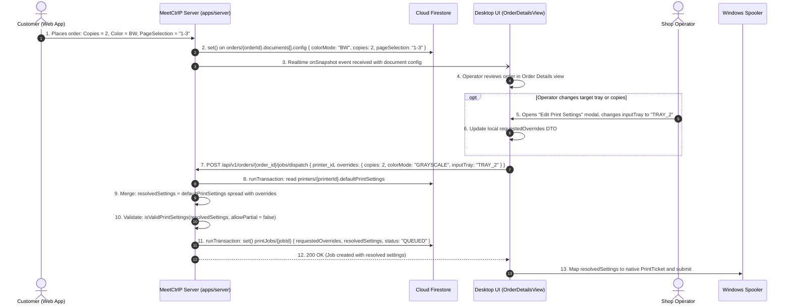

# Section 05: Print Configuration, Presets & Overrides Engine

## 1. Product Requirements & MVP Scope

Based on `FRD_MVP.md` and `meetctrlp_print_shop_partner_desktop_mvp_requirements.md`:

| Feature | Scope | Rationale / Day-0 Requirement |
|---------|-------|-------------------------------|
| **Color Mode (B&W / Color)** | **T0** | Fundamental customer request. Must match printer capability. |
| **Copies (1 to 999)** | **T0** | Multi-copy printing must be spooled efficiently. |
| **Paper Size (A4 Baseline)** | **T0** | Standard Xerox / photocopy size across Indian commercial print shops. |
| **Page Selection Syntax** | **T0** | Subsets such as `"1,3,5-8"` or `"all"`. Affects billing and physical output. |
| **Printer Baseline Presets** | **T0** | Stored per physical printer (`/shops/{shopId}/printers/{printerId}.defaultPrintSettings`). |
| **Per-Job Requested Overrides** | **T0** | Customer specifications applied on top of printer defaults. |
| **Operator Manual Overrides** | **T0** | Shop operator can adjust tray or paper size if paper tray is empty. |
| **Duplex (Two-Sided)** | **Later** | Explicitly out of Day-0 MVP scope. Simplex only for initial launch. |

---

## 2. Data Points & Storage Matrix (Cloud Firestore vs Client Overrides)

Configuration data points start with customer intent, combine with hardware presets, and freeze as immutable map snapshots in **Cloud Firestore**:

| Data Point | Origin / Capture Source | Client Capture Method | Transport / DTO Format | Destination Storage | Storage Format & Constraints |
| :--- | :--- | :--- | :--- | :--- | :--- |
| **Customer Color Choice** | Web App Selector | Read from order document config | JSON `{ color_mode: "BW" }` | **Cloud Firestore** | `orders/{orderId}.documents[].config.colorMode` (string enum) |
| **Requested Copies** | Web App Counter | Read from order document config | JSON `{ copies: 2 }` | **Cloud Firestore** | `orders/{orderId}.documents[].config.copies` (number, 1..999) |
| **Page Selection String** | Customer / Operator | Web App / Desktop UI | JSON `{ page_selection: "1,3,5-8" }` | **Cloud Firestore** | `orders/{orderId}.documents[].config.pageSelection` (string) |
| **Selected Page List** | C# Parser Calculation | `PageSelectionParser.Parse()` | In-Memory `List<int>` | Client RAM | Internal page index array for spooler |
| **Printer Preset Settings** | Hardware Configuration | Loaded from `/shops/{shopId}/printers/{printerId}` | JSON `{ defaultPrintSettings }` | **Cloud Firestore** | `printers/{printerId}.defaultPrintSettings` (map) |
| **Job Requested Overrides** | Customer Request / Operator | Formed on Dispatch | JSON `{ requestedOverrides }` | **Cloud Firestore** | `orders/{orderId}/printJobs/{jobId}.requestedOverrides` (map, partial) |
| **Resolved Settings Snapshot** | Server / Desktop Resolver | Shallow Map Merge | JSON `{ resolvedSettings }` | **Cloud Firestore** | `orders/{orderId}/printJobs/{jobId}.resolvedSettings` (map, complete) |

---

## 3. End-to-End Configuration Resolution Data Flow



---

## 4. Technical Build Specification

### 4.1 Page Selection Parsing & Verification
```csharp
public static class PageSelectionParser
{
    private static readonly Regex RangeRegex = new Regex(@"^(\d+(-\d+)?)(,\s*\d+(-\d+)?)*$", RegexOptions.Compiled);

    public static List<int> ParseAndValidate(string selection, int totalPages)
    {
        if (string.IsNullOrWhiteSpace(selection) || selection.Trim().Equals("all", StringComparison.OrdinalIgnoreCase))
        {
            return Enumerable.Range(1, totalPages).ToList();
        }

        if (!RangeRegex.IsMatch(selection))
            throw new ArgumentException("Invalid page selection format. Expected e.g. '1,3,5-8'.");

        var pages = new HashSet<int>();
        var parts = selection.Split(',');

        foreach (var part in parts)
        {
            var trimmed = part.Trim();
            if (trimmed.Contains('-'))
            {
                var sub = trimmed.Split('-');
                int start = int.Parse(sub[0]);
                int end = int.Parse(sub[1]);

                if (start < 1 || end > totalPages || start > end)
                    throw new ArgumentOutOfRangeException($"Page range '{trimmed}' out of bounds (1..{totalPages}).");

                for (int p = start; p <= end; p++) pages.Add(p);
            }
            else
            {
                int p = int.Parse(trimmed);
                if (p < 1 || p > totalPages)
                    throw new ArgumentOutOfRangeException($"Page number {p} out of bounds (1..{totalPages}).");
                pages.Add(p);
            }
        }

        return pages.OrderBy(p => p).ToList();
    }
}
```

### 4.2 Deterministic Map Snapshot Contract
When a print job is created, the system applies a shallow map merge:
$$\text{resolvedSettings} = \text{printers/\{printerId\}.defaultPrintSettings} \mathbin{\|} \text{printJobs/\{jobId\}.requestedOverrides}$$

#### Rules:
1. `printers/{printerId}.defaultPrintSettings` is **read-only** during job creation and is never mutated by a job.
2. `printJobs/{jobId}.resolvedSettings` contains the complete, validated execution recipe.
3. If the printer baseline is edited tomorrow, past `printJobs` documents remain identical and reproducible.

---

## 5. Screen UI & Interaction Design

In **Screen 3: Order Details**:
- **Print Configuration Strip:**
  - Displays tags: `2 Copies` • `B&W Monochrome` • `Pages: 1-3 (3 pages)` • `A4`.
- **Edit Settings Modal (`PrintSettingsModal.xaml`):**
  - Allows operator to switch target printer or override tray.
  - Live capability warning: If customer requested color but operator assigns a monochrome printer, UI displays amber warning banner: *"Warning: Selected printer cannot produce color output."*

---

## 6. Firestore Collection Blueprint

### 6.1 Print Job Document — Create with Resolved Settings (Transaction)

```typescript
import { getFirebaseFirestore } from "@ctrlp/firebase";
import { FieldValue, Timestamp } from "firebase-admin/firestore";

const db = getFirebaseFirestore();

/**
 * Atomically reads the printer's defaultPrintSettings, merges with operator
 * overrides, validates, and writes the printJob document.
 *
 * Collection path: /shops/{shopId}/orders/{orderId}/printJobs/{jobId}
 */
async function createPrintJobWithResolvedSettings(
  shopId: string,
  orderId: string,
  jobId: string,
  printerId: string,
  requestedOverrides: Record<string, unknown>
): Promise<void> {
  const printerRef = db.doc(`shops/${shopId}/printers/${printerId}`);
  const jobRef = db.doc(`shops/${shopId}/orders/${orderId}/printJobs/${jobId}`);

  await db.runTransaction(async (tx) => {
    // Step 1: Read the printer's baseline defaults inside the transaction
    const printerSnap = await tx.get(printerRef);
    if (!printerSnap.exists) {
      throw new Error(`Printer ${printerId} not found in shop ${shopId}`);
    }

    const printerData = printerSnap.data()!;
    const defaultPrintSettings = (printerData.defaultPrintSettings ?? {}) as Record<string, unknown>;

    // Step 2: Shallow merge — overrides win over defaults
    const resolvedSettings: Record<string, unknown> = {
      ...defaultPrintSettings,
      ...requestedOverrides,
    };

    // Step 3: Validate resolved settings are complete (no undefined critical keys)
    const requiredKeys = ["colorMode", "copies", "paperSize", "pageSelection", "inputTray"];
    for (const key of requiredKeys) {
      if (resolvedSettings[key] === undefined || resolvedSettings[key] === null) {
        throw new Error(`Resolved settings missing required field: "${key}"`);
      }
    }

    // Step 4: Write the printJob document atomically
    tx.set(jobRef, {
      orderId,
      shopId,
      printerId,
      requestedOverrides,      // Partial — what the operator/customer asked for
      resolvedSettings,        // Complete — the immutable execution recipe
      status: "QUEUED",
      createdAt: FieldValue.serverTimestamp(),
      updatedAt: FieldValue.serverTimestamp(),
    });
  });
}
```

### 6.2 Firestore Document Shape

```
/shops/{shopId}/orders/{orderId}
  documents: [
    {
      fileId: string,
      fileName: string,
      config: {
        colorMode: "BW" | "COLOR",    // number: integer enum stored as string
        copies: number,               // 1..999
        paperSize: "A4" | "A3",
        pageSelection: string,        // e.g. "1,3,5-8" or "all"
        inputTray: string | null      // null until operator assigns
      }
    }
  ]

/shops/{shopId}/orders/{orderId}/printJobs/{jobId}
  orderId:            string
  shopId:             string
  printerId:          string
  requestedOverrides: {               // Partial map — only fields explicitly set
    colorMode?:    "BW" | "COLOR"
    copies?:       number
    paperSize?:    "A4" | "A3"
    pageSelection?: string
    inputTray?:    string
  }
  resolvedSettings: {                 // Complete, frozen execution recipe
    colorMode:     "BW" | "COLOR"
    copies:        number
    paperSize:     "A4" | "A3"
    pageSelection: string
    inputTray:     string
  }
  status:             "QUEUED" | "PRINTING" | "DONE" | "ERROR"
  createdAt:          Timestamp
  updatedAt:          Timestamp
```

> [!NOTE]
> `resolvedSettings` is written once at job creation and is **never mutated** after that. This guarantees that billing recalculations and reprint operations always reproduce the exact same output even if `printers/{printerId}.defaultPrintSettings` changes later.

> [!TIP]
> All monetary values (e.g. job cost) are stored as integer minor units (paise) using Firestore `number` type — equivalent to the former `BIGINT` columns in PostgreSQL.
