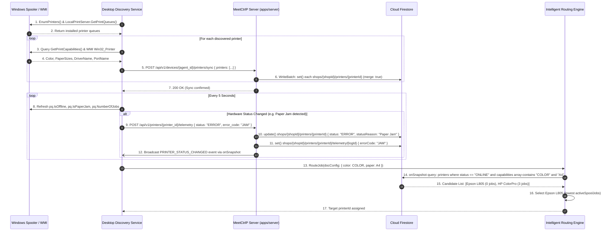

# Section 06: Printer Discovery, Capability Detection & Intelligent Routing

## 1. Product Requirements & MVP Scope

Based on `FRD_MVP.md` and `meetctrlp_print_shop_partner_desktop_mvp_requirements.md`:

| Feature | Scope | Rationale / Day-0 Requirement |
|---------|-------|-------------------------------|
| **Local Printer Discovery** | **T0** | Auto-detect all USB, LAN, and Wi-Fi printers installed on the Windows host. |
| **Capability Detection** | **T0** | Query printer drivers for Color vs Monochrome, supported trays, and paper sizes (A4, A3). |
| **Intelligent Routing** | **T0** | Auto-match incoming jobs to compatible, online, least-busy printers. |
| **Manual Printer Reassignment** | **T0** | Operator can override auto-selected printer with one click before or after an error. |
| **Printer Status Monitoring** | **T0** | Live polling of printer states: `ONLINE`, `OFFLINE`, `PRINTING`, `ERROR` (Jam, Out of Paper). |
| **Test Page Execution** | **T0** | Diagnostic tool to verify hardware communication directly from Screen 5 (Printers). |
| **Driver Installation Assistant** | **Later** | Out of MVP scope. Operators use standard Windows manufacturer setup. |

---

## 2. Data Points & Storage Matrix (Win32 Spooler vs Cloud Firestore)

Hardware inventory and live telemetry originate from the client's Windows OS and are persisted in **Cloud Firestore**:

| Data Point | Origin / Capture Source | Client Capture Method | Transport / DTO Format | Destination Storage | Storage Format & Constraints |
| :--- | :--- | :--- | :--- | :--- | :--- |
| **Printer Display Name** | Windows Spooler Queue | `PrintQueue.Name` | JSON `{ name: "Canon iR2006" }` | **Cloud Firestore** | `shops/{shopId}/printers/{printerId}.name` (string, max 150) |
| **System Full Name** | Windows Spooler Queue | `PrintQueue.FullName` | JSON `{ system_name: "..." }` | **Cloud Firestore** | `shops/{shopId}/printers/{printerId}.systemName` (unique per agent) |
| **Driver Name** | Windows Print Driver | `PrintQueue.QueueDriver.Name` | JSON `{ driver_name: "..." }` | **Cloud Firestore** | `shops/{shopId}/printers/{printerId}.driverName` (string, max 255) |
| **Port Name** | Windows Port Monitor | `PrintQueue.QueuePort.Name` | JSON `{ port_name: "USB001" }` | **Cloud Firestore** | `shops/{shopId}/printers/{printerId}.portName` (string, max 150) |
| **Color Capability** | Win32 Driver Caps | `OutputColorCapability.Contains(Color)` | JSON `{ is_color_capable: true }` | **Cloud Firestore** | `shops/{shopId}/printers/{printerId}.isColorCapable` (boolean) |
| **Paper Sizes (A4, A3)** | Win32 Driver Caps | `PageMediaSizeCapability` | JSON `{ capabilities: ["A4", "A3"] }` | **Cloud Firestore** | `shops/{shopId}/printers/{printerId}.capabilities` (string array) |
| **Live Status** | Polled Spooler/WMI | `pq.IsOffline`, `pq.IsPaperJam` | JSON `{ status: "ERROR", reason: "Jam" }` | **Cloud Firestore** | `shops/{shopId}/printers/{printerId}.status` & `.statusReason` (strings) |
| **Telemetry History** | Hardware State Change | Polled every 5 seconds | JSON `{ error_code: "PAPER_JAM" }` | **Cloud Firestore** | `shops/{shopId}/printers/{printerId}/telemetry/{logId}` (subcollection) |
| **Active Spooler Jobs** | Windows Spooler | `pq.NumberOfJobs` | JSON `{ active_spool_jobs: 2 }` | In-Memory / Cloud Firestore | `shops/{shopId}/printers/{printerId}/telemetry/{logId}.activeSpoolJobs` (number) |

---

## 3. End-to-End Printer Discovery & Routing Data Flow



---

## 4. Technical Build Specification

### 4.1 C# Windows Printer Enumerator
```csharp
public class WindowsPrinterDiscoveryService
{
    public List<DiscoveredPrinterDto> DiscoverPrinters()
    {
        var result = new List<DiscoveredPrinterDto>();
        using var printServer = new LocalPrintServer();
        var printQueues = printServer.GetPrintQueues(new[] {
            EnumeratedPrintQueueTypes.Local,
            EnumeratedPrintQueueTypes.Connections
        });

        foreach (var pq in printQueues)
        {
            pq.Refresh();
            var caps = pq.GetPrintCapabilities();

            bool isColor = caps.OutputColorCapability.Contains(OutputColor.Color);
            bool supportsA4 = caps.PageMediaSizeCapability.Any(s => s.PageMediaSizeName == PageMediaSizeName.ISOA4);
            bool supportsA3 = caps.PageMediaSizeCapability.Any(s => s.PageMediaSizeName == PageMediaSizeName.ISOA3);

            result.Add(new DiscoveredPrinterDto
            {
                Name = pq.Name,
                SystemName = pq.FullName,
                DriverName = pq.QueueDriver?.Name ?? "Generic",
                PortName = pq.QueuePort?.Name ?? "LPT1",
                IsColorCapable = isColor,
                SupportsA4 = supportsA4,
                SupportsA3 = supportsA3,
                IsOffline = pq.IsOffline,
                IsPaperJam = pq.IsPaperJam,
                ActiveJobs = pq.NumberOfJobs
            });
        }
        return result;
    }
}
```

---

## 5. Screen UI: Screen 5 (Printers)

- **Printer Card List (`PrintersView.xaml`):**
  - Card Header: Printer Name (`Canon iR2006`) + Manufacturer (`Canon UFR II Driver`).
  - Badges: `Default Printer` • `B&W Only` • `A4 / A3` • `Port: USB001`.
  - Live Status Pill:
    - Green `● Online (0 active jobs)`
    - Amber `⚠ Out of Paper - Tray 1`
    - Red `✕ Paper Jam - Open Front Door`
  - Action Button: `Print Test Page` (dispatches 1-page alignment diagnostic).

---

## 6. Firestore Collection Blueprint

### 6.1 Batch-Upsert Discovered Printers

```typescript
import { getFirebaseFirestore } from "@ctrlp/firebase";
import { FieldValue } from "firebase-admin/firestore";

const db = getFirebaseFirestore();

interface DiscoveredPrinterDto {
  printerId: string;
  name: string;
  systemName: string;
  driverName: string;
  portName: string;
  isColorCapable: boolean;
  isDuplexCapable: boolean;
  capabilities: string[];       // e.g. ["A4", "A3", "COLOR"]
  defaultPrintSettings: Record<string, unknown>;
}

/**
 * Batch-upserts all discovered printers into:
 *   /shops/{shopId}/printers/{printerId}
 *
 * Uses WriteBatch so all upserts are committed atomically (max 500 docs per batch).
 */
async function syncDiscoveredPrinters(
  shopId: string,
  printers: DiscoveredPrinterDto[]
): Promise<void> {
  // Firestore WriteBatch limit is 500 operations — chunk if needed
  const BATCH_SIZE = 400;

  for (let i = 0; i < printers.length; i += BATCH_SIZE) {
    const chunk = printers.slice(i, i + BATCH_SIZE);
    const batch = db.batch();

    for (const printer of chunk) {
      const ref = db.doc(`shops/${shopId}/printers/${printer.printerId}`);
      batch.set(
        ref,
        {
          shopId,
          name: printer.name,
          systemName: printer.systemName,
          driverName: printer.driverName,
          portName: printer.portName,
          isColorCapable: printer.isColorCapable,
          isDuplexCapable: printer.isDuplexCapable,
          capabilities: printer.capabilities,
          defaultPrintSettings: printer.defaultPrintSettings,
          status: "ONLINE",
          statusReason: null,
          updatedAt: FieldValue.serverTimestamp(),
        },
        { merge: true }   // Upsert: preserve fields not included in this sync
      );
    }

    await batch.commit();
  }
}
```

### 6.2 Write Telemetry Events

```typescript
/**
 * Records a hardware state-change event to the telemetry subcollection:
 *   /shops/{shopId}/printers/{printerId}/telemetry/{logId}
 *
 * Also atomically updates the printer's live status fields.
 */
async function writePrinterTelemetry(
  shopId: string,
  printerId: string,
  payload: {
    previousStatus: string;
    newStatus: string;
    errorCode: string | null;
    errorDescription: string | null;
    activeSpoolJobs: number;
  }
): Promise<void> {
  const printerRef = db.doc(`shops/${shopId}/printers/${printerId}`);
  const telemetryRef = db
    .collection(`shops/${shopId}/printers/${printerId}/telemetry`)
    .doc(); // Auto-generated logId

  const batch = db.batch();

  // Update live status on the printer document
  batch.update(printerRef, {
    status: payload.newStatus,
    statusReason: payload.errorDescription ?? null,
    updatedAt: FieldValue.serverTimestamp(),
  });

  // Append immutable telemetry log entry
  batch.set(telemetryRef, {
    shopId,
    printerId,
    previousStatus: payload.previousStatus,
    newStatus: payload.newStatus,
    errorCode: payload.errorCode ?? null,
    errorDescription: payload.errorDescription ?? null,
    activeSpoolJobs: payload.activeSpoolJobs,
    createdAt: FieldValue.serverTimestamp(),
  });

  await batch.commit();
}
```

### 6.3 Real-Time Printer Status Listener (Desktop onSnapshot)

```typescript
import { getFirebaseFirestore } from "@ctrlp/firebase";

const db = getFirebaseFirestore();

/**
 * Subscribes to the printers subcollection for live status updates.
 * The Desktop UI calls this once on startup; Firestore pushes diffs automatically.
 *
 * Collection: /shops/{shopId}/printers
 */
function subscribeToPrinterStatus(
  shopId: string,
  onUpdate: (printers: FirestorePrinterDoc[]) => void,
  onError: (err: Error) => void
): () => void {
  const printersRef = db.collection(`shops/${shopId}/printers`);

  const unsubscribe = printersRef.onSnapshot(
    (snapshot) => {
      const printers: FirestorePrinterDoc[] = snapshot.docs.map((doc) => ({
        printerId: doc.id,
        ...(doc.data() as Omit<FirestorePrinterDoc, "printerId">),
      }));
      onUpdate(printers);
    },
    (err) => onError(err)
  );

  // Return the unsubscribe function so the caller can clean up on component teardown
  return unsubscribe;
}

/**
 * Intelligent routing: query ONLINE printers with required capabilities,
 * then pick the one with the fewest active spool jobs.
 *
 * Uses a one-time .get() rather than a listener since routing is a point-in-time decision.
 */
async function routeJobToOptimalPrinter(
  shopId: string,
  requiredCapabilities: string[]  // e.g. ["COLOR", "A4"]
): Promise<string> {
  const snapshot = await db
    .collection(`shops/${shopId}/printers`)
    .where("status", "==", "ONLINE")
    .get();

  const candidates = snapshot.docs
    .map((doc) => ({ printerId: doc.id, ...doc.data() } as FirestorePrinterDoc))
    .filter((p) =>
      requiredCapabilities.every((cap) => (p.capabilities ?? []).includes(cap))
    );

  if (candidates.length === 0) {
    throw new Error("No compatible ONLINE printer available for the requested job.");
  }

  // Select the printer with the least active spool jobs (least-busy routing)
  candidates.sort((a, b) => (a.activeSpoolJobs ?? 0) - (b.activeSpoolJobs ?? 0));
  return candidates[0].printerId;
}

interface FirestorePrinterDoc {
  printerId: string;
  shopId: string;
  name: string;
  systemName: string;
  driverName: string;
  portName: string;
  isColorCapable: boolean;
  isDuplexCapable: boolean;
  capabilities: string[];
  defaultPrintSettings: Record<string, unknown>;
  status: "ONLINE" | "OFFLINE" | "PRINTING" | "ERROR";
  statusReason: string | null;
  activeSpoolJobs?: number;
  updatedAt: FirebaseFirestore.Timestamp;
}
```

### 6.4 Firestore Document Shape

```
/shops/{shopId}/printers/{printerId}
  shopId:              string
  name:                string          // "Canon iR2006"
  systemName:          string          // unique per agent
  driverName:          string          // "Canon UFR II"
  portName:            string          // "USB001"
  isColorCapable:      boolean
  isDuplexCapable:     boolean
  capabilities:        string[]        // ["A4", "A3", "COLOR"]
  defaultPrintSettings: {
    colorMode:         "BW" | "COLOR"
    paperSize:         "A4" | "A3"
    copies:            number
    inputTray:         string
    pageSelection:     "all"
  }
  status:              "ONLINE" | "OFFLINE" | "PRINTING" | "ERROR"
  statusReason:        string | null   // e.g. "Paper Jam - Tray 1"
  updatedAt:           Timestamp

/shops/{shopId}/printers/{printerId}/telemetry/{logId}
  shopId:              string
  printerId:           string
  previousStatus:      string
  newStatus:           string
  errorCode:           string | null   // e.g. "PAPER_JAM"
  errorDescription:    string | null
  activeSpoolJobs:     number
  createdAt:           Timestamp
```

> [!NOTE]
> The telemetry subcollection grows as an append-only log. Query with `.orderBy("createdAt", "desc").limit(N)` to fetch the most recent N events without a full collection scan.

> [!TIP]
> For intelligent routing, keep `activeSpoolJobs` on the top-level `printers/{printerId}` document (updated via the same telemetry batch write). This lets the routing query avoid reading the entire telemetry subcollection — a single `.where("status", "==", "ONLINE").get()` is sufficient to rank candidates.
