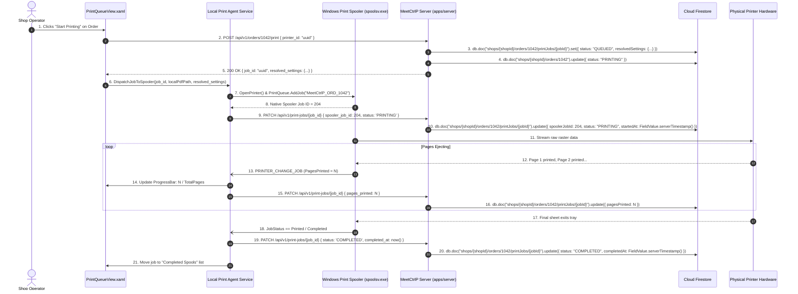

# Section 07: Local Print Agent & Windows Spooler Execution

## 1. Product Requirements & MVP Scope

Based on `FRD_MVP.md` and `meetctrlp_print_shop_partner_desktop_mvp_requirements.md`:

| Feature | Scope | Rationale / Day-0 Requirement |
|---------|-------|-------------------------------|
| **Start Printing Trigger** | **T0** | Operator explicitly dispatches accepted order to the physical printer. |
| **Spooling to Physical Printer** | **T0** | Core Day-0 execution layer converting PDF into Windows spool jobs. |
| **Print Progress Visibility** | **T0** | Live indicator of page count spooled and printed (`Page 4 of 12`). |
| **Print Failure Detection** | **T0** | Immediate detection of jams, out-of-paper, and spooler errors. |
| **Retry Workflow** | **T0** | One-click retry on current or alternative printer upon hardware error. |
| **Print Job Cancellation** | **T0** | Operator can cancel spooled job before or during physical execution. |
| **Physical Print Verification** | **T0** | Final confirmation that paper exited the tray before marking order `READY`. |

---

## 2. Data Points & Storage Matrix (Windows Spooler vs Cloud Firestore)

Physical execution telemetry is captured directly from the Windows Spooler API and stored in **Cloud Firestore**:

| Data Point | Origin / Capture Source | Client Capture Method | Transport / DTO Format | Destination Storage | Storage Format & Constraints |
| :--- | :--- | :--- | :--- | :--- | :--- |
| **Windows Spooler Job ID**| Windows Print Spooler | `jobInfo.JobIdentifier` | JSON `{ spooler_job_id: 104 }` | **Cloud Firestore** | `shops/{shopId}/orders/{orderId}/printJobs/{jobId}.spoolerJobId` (`number`) |
| **Total Pages to Print** | Document Parser × Copies | `doc.PageCount * config.Copies` | JSON `{ pages_total: 24 }` | **Cloud Firestore** | `shops/{shopId}/orders/{orderId}/printJobs/{jobId}.pagesTotal` (`number`, ≥ 1) |
| **Pages Printed So Far** | Spooler Notification | `jobInfo.NumberOfPagesPrinted` | JSON `{ pages_printed: 8 }` | **Cloud Firestore** | `shops/{shopId}/orders/{orderId}/printJobs/{jobId}.pagesPrinted` (`number`, ≤ pagesTotal) |
| **Print Job Status** | Spooler Notification Hook | `EnumJobs` / `PRINTER_CHANGE_JOB`| JSON `{ status: "PRINTING" }` | **Cloud Firestore** | `shops/{shopId}/orders/{orderId}/printJobs/{jobId}.status` (`string` enum) |
| **Spooler Error Code** | Windows Win32 LastError | `Marshal.GetLastWin32Error()` | JSON `{ error_code: "JAM" }` | **Cloud Firestore** | `shops/{shopId}/orders/{orderId}/printJobs/{jobId}.errorCode` (`string`) |
| **Retry Counter** | Operator Action | Incremented on Retry click | JSON `{ retry_count: 1 }` | **Cloud Firestore** | `shops/{shopId}/orders/{orderId}/printJobs/{jobId}.retryCount` (`number`, ≥ 0) |
| **Queue Priority** | Operator Priority Flag | Normal=0, Rush=10 | JSON `{ priority: 10 }` | **Cloud Firestore** | `shops/{shopId}/orders/{orderId}/printJobs/{jobId}.priority` (`number`, ≥ 0) |
| **Cancellation Audit** | Current User Session | `AuthSession.User.Id` | JSON `{ cancelled_by_id }` | **Cloud Firestore** | `shops/{shopId}/orders/{orderId}/printJobs/{jobId}.cancelledById`, `.cancelledByType` |

---

## 3. End-to-End Physical Print Execution Data Flow



---

## 4. Technical Build Specification

### 4.1 Native Windows Spooler Hook (C# Implementation)
```csharp
public class SpoolerMonitorService
{
    public void WatchPrintJob(IntPtr hPrinter, int spoolerJobId, Action<int, bool, string> onProgress)
    {
        Task.Run(() =>
        {
            while (true)
            {
                var jobInfo = GetJobInfo(hPrinter, spoolerJobId);
                if (jobInfo == null) break;

                int printed = jobInfo.PagesPrinted;
                bool isError = (jobInfo.Status & JOB_STATUS_ERROR) != 0 || (jobInfo.Status & JOB_STATUS_PAPEROUT) != 0;
                string errorDesc = isError ? "Hardware Error / Out of Paper" : null;

                onProgress(printed, isError, errorDesc);

                if ((jobInfo.Status & JOB_STATUS_PRINTED) != 0 || (jobInfo.Status & JOB_STATUS_DELETED) != 0)
                {
                    break;
                }

                Thread.Sleep(1000);
            }
        });
    }
}
```

---

## 5. Screen UI: Screen 4 (Print Queue)

- **Print Queue Grid (`PrintQueueView.xaml`):**
  - Columns: Order #, Document Name, Target Printer, Pages Spooled (`Page 8 of 24`), Progress Bar, Status Badge.
  - Progress Bar: MeetCtrlP Green bar (`#16A34A`), smooth animated fill.
  - Error Interventions:
    - Amber pill: `Retrying (Attempt 1 of 3)`
    - Red pill: `Paper Jam on Canon iR2006`
  - Context Menu Actions:
    - `Pause Job` / `Resume Job`
    - `Cancel Spool`
    - `Reassign to Alternate Printer`

---

## 6. Firestore Collection Blueprint & Constraints

### 6.a — Create a `printJob` document at subcollection path

```typescript
import { getFirebaseFirestore } from "@ctrlp/firebase";
import { FieldValue, Timestamp } from "firebase-admin/firestore";

const db = getFirebaseFirestore();

/**
 * Called by the server when the operator clicks "Start Printing".
 * Creates a new printJob document under the order's subcollection.
 */
async function createPrintJob(
  shopId: string,
  orderId: string,
  jobId: string,
  printerId: string,
  resolvedSettings: Record<string, unknown>,
  pagesTotal: number,
  priority: number = 0
) {
  const jobRef = db.doc(
    `shops/${shopId}/orders/${orderId}/printJobs/${jobId}`
  );

  await jobRef.set({
    printerId,
    resolvedSettings,
    status: "QUEUED",
    pagesTotal,
    pagesPrinted: 0,
    spoolerJobId: null,
    errorCode: null,
    errorMessage: null,
    retryCount: 0,
    priority,
    cancelledById: null,
    cancelledByType: null,
    queuedAt: FieldValue.serverTimestamp(),
    assignedAt: null,
    spooledAt: null,
    startedAt: null,
    completedAt: null,
  });

  // Also flip the parent order to PRINTING
  await db
    .doc(`shops/${shopId}/orders/${orderId}`)
    .update({ status: "PRINTING", updatedAt: FieldValue.serverTimestamp() });
}
```

---

### 6.b — Update live print progress with `FieldValue.increment`

```typescript
/**
 * Called on every PRINTER_CHANGE_JOB spooler notification.
 * Uses FieldValue.increment for safe concurrent updates instead of
 * reading-then-writing the counter.
 */
async function onPagePrinted(
  shopId: string,
  orderId: string,
  jobId: string,
  absolutePagesPrinted: number
) {
  const jobRef = db.doc(
    `shops/${shopId}/orders/${orderId}/printJobs/${jobId}`
  );

  // Option A — absolute write (preferred when spooler reports cumulative total)
  await jobRef.update({
    pagesPrinted: absolutePagesPrinted,
    updatedAt: FieldValue.serverTimestamp(),
  });
}

/**
 * Option B — atomic increment (use when only a delta "+1" is known)
 */
async function incrementPagesPrinted(
  shopId: string,
  orderId: string,
  jobId: string
) {
  const jobRef = db.doc(
    `shops/${shopId}/orders/${orderId}/printJobs/${jobId}`
  );

  await jobRef.update({
    pagesPrinted: FieldValue.increment(1),
    updatedAt: FieldValue.serverTimestamp(),
  });
}

/**
 * Called when the spooler reports the job as fully COMPLETED.
 */
async function markJobCompleted(
  shopId: string,
  orderId: string,
  jobId: string
) {
  const jobRef = db.doc(
    `shops/${shopId}/orders/${orderId}/printJobs/${jobId}`
  );

  await jobRef.update({
    status: "COMPLETED",
    completedAt: FieldValue.serverTimestamp(),
    updatedAt: FieldValue.serverTimestamp(),
  });
}

/**
 * Called when the spooler reports a hardware error.
 */
async function markJobError(
  shopId: string,
  orderId: string,
  jobId: string,
  errorCode: string,
  errorMessage: string
) {
  const jobRef = db.doc(
    `shops/${shopId}/orders/${orderId}/printJobs/${jobId}`
  );

  await jobRef.update({
    status: "ERROR",
    errorCode,
    errorMessage,
    retryCount: FieldValue.increment(1),
    updatedAt: FieldValue.serverTimestamp(),
  });
}
```

---

### 6.c — `onSnapshot` listener for the WPF Print Queue screen

```typescript
/**
 * Server-side or Electron bridge: sets up a real-time listener on the
 * printJobs subcollection for a given shop.  Changes are pushed to the
 * WPF client via SignalR / named-pipe bridge so PrintQueueView.xaml
 * can update its ObservableCollection<PrintJobViewModel> live.
 *
 * Filters to only QUEUED / PRINTING / ERROR jobs to keep the payload small.
 */
function subscribeToPrintQueue(
  shopId: string,
  onUpdate: (jobs: FirebaseFirestore.QuerySnapshot) => void
): () => void {
  // Listen across ALL orders for this shop that have active print jobs
  // by querying the printJobs subcollection group.
  const unsubscribe = db
    .collectionGroup("printJobs")
    .where("shopId", "==", shopId)          // shopId denormalized on each job doc
    .where("status", "in", ["QUEUED", "PRINTING", "ERROR"])
    .orderBy("priority", "desc")
    .orderBy("queuedAt", "asc")
    .onSnapshot(
      (snapshot) => {
        onUpdate(snapshot);
      },
      (error) => {
        console.error("[PrintQueue] Firestore snapshot error:", error);
      }
    );

  // Return the unsubscribe function so the caller can detach when the
  // WPF window is closed or the operator logs out.
  return unsubscribe;
}

/**
 * Narrower variant: listen to printJobs for a single specific order.
 * Used on the Order Detail screen to show job history for one order.
 */
function subscribeToOrderPrintJobs(
  shopId: string,
  orderId: string,
  onUpdate: (jobs: FirebaseFirestore.QuerySnapshot) => void
): () => void {
  return db
    .collection(`shops/${shopId}/orders/${orderId}/printJobs`)
    .orderBy("queuedAt", "asc")
    .onSnapshot(onUpdate);
}
```

> [!NOTE]
> `collectionGroup("printJobs")` requires a **Firestore composite index** on `(shopId ASC, status ASC, priority DESC, queuedAt ASC)`. Add this index to `firestore.indexes.json` before deploying.

> [!IMPORTANT]
> Firestore field constraints (equivalent to the old SQL CHECK constraint) must be enforced in **Cloud Firestore Security Rules** and/or server-side validation:
> - `pagesTotal >= 1`
> - `pagesPrinted >= 0 && pagesPrinted <= pagesTotal`
> - `retryCount >= 0`
> - `priority >= 0`
