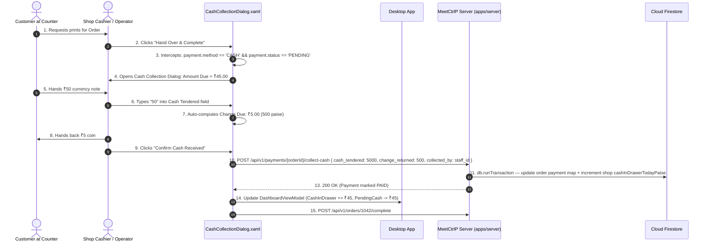

# Section 08: Payments, Cash Collection & Financial Reconciliation

## 1. Product Requirements & MVP Scope

Based on `FRD_MVP.md` and `meetctrlp_print_shop_partner_desktop_mvp_requirements.md`:

| Feature | Scope | Rationale / Day-0 Requirement |
|---------|-------|-------------------------------|
| **Cash Payment Handling** | **T0** | Cash at counter is the primary payment habit across Indian local Xerox shops. |
| **Payment Status Visibility** | **T0** | Realtime indication of whether order is already paid online or pending cash. |
| **Cash Collection Confirmation** | **T0** | Cashier must explicitly confirm receiving currency before releasing prints. |
| **Daily Revenue Tracking** | **T0** | Dashboard breakdown: Total Revenue, Online Settled, Cash Collected, Cash Pending. |
| **Online Payment Gateway Sync** | **T0** | Cashfree webhook verification for UPI/card payments. |
| **Automated Refunds on Rejection** | **T0** | Immediate reversal if shop rejects a customer order already paid online. |
| **Credit / Account Ledger** | **Later** | Student/corporate credit accounts deferred to post-MVP. |

---

## 2. Data Points & Storage Matrix (Cloud Firestore vs Client Cashier Drawer)

Financial transactions and counter cash drawer events are stored in **Cloud Firestore** as an embedded `payment` map inside the order document, and displayed on the desktop UI:

| Data Point | Origin / Capture Source | Client Capture Method | Transport / DTO Format | Destination Storage | Storage Format & Constraints |
| :--- | :--- | :--- | :--- | :--- | :--- |
| **Order Total Due** | Frozen Order Items | Read from `orders/{orderId}.totalMinorUnits` | JSON `{ amount_minor_units: 4500 }` | **Cloud Firestore** | `shops/{shopId}/orders/{orderId}.payment.amountMinorUnits` (`number`, ≥ 0) |
| **Payment Method** | Customer Selection | Web App / Counter Choice | JSON `{ method: "CASH" }` | **Cloud Firestore** | `shops/{shopId}/orders/{orderId}.payment.method` (`"ONLINE"` or `"CASH"`) |
| **Payment Status** | Gateway / Cashier | Webhook / Cash Collection Modal | JSON `{ status: "PAID" }` | **Cloud Firestore** | `shops/{shopId}/orders/{orderId}.payment.status` (`string` enum) |
| **Cash Tendered by Customer**| Cashier Input | WPF `CashDialog.xaml` (TextBox) | JSON `{ cash_tendered_minor_units: 5000 }`| **Cloud Firestore** | `shops/{shopId}/orders/{orderId}.payment.cashTenderedPaise` (`number`) |
| **Change Returned to Customer**| System Math Calculation| `tendered - amount_due` | JSON `{ change_returned_minor_units: 500 }`| **Cloud Firestore** | `shops/{shopId}/orders/{orderId}.payment.changeReturnedPaise` (`number`) |
| **Collecting Staff User ID** | Logged-in Staff Session| `AuthSession.User.Id` | JSON `{ collected_by_shop_user_id: "uuid" }`| **Cloud Firestore** | `shops/{shopId}/orders/{orderId}.payment.collectedByUserId` (`string`) |
| **Cash Collection Timestamp**| Clock on Handover | `DateTime.UtcNow` | JSON `{ collected_at: "2026-09-26..." }`| **Cloud Firestore** | `shops/{shopId}/orders/{orderId}.payment.collectedAt` (`Timestamp`) |
| **Cashfree Transaction ID** | Cashfree Webhook | Gateway Payload | JSON `{ provider_transaction_id: "cf_..." }`| **Cloud Firestore** | `shops/{shopId}/orders/{orderId}.payment.providerTransactionId` (`string`) |
| **Refund Record** | Cloud Reversal Engine | Triggered on Order Rejection | JSON `{ refund_id, status: "SUCCESS" }` | **Cloud Firestore** | `shops/{shopId}/orders/{orderId}.payment.refund{}` (embedded map) |

---

## 3. End-to-End Payment & Counter Reconciliation Data Flow



---

## 4. Technical Build Specification

### 4.1 Cash Change Calculation Logic (C#)
```csharp
public class CashCollectionViewModel : ObservableObject
{
    private readonly long _orderTotalPaise;
    private long _tenderedPaise;

    public decimal OrderTotalInr => _orderTotalPaise / 100m;

    public decimal TenderedInr
    {
        get => _tenderedPaise / 100m;
        set
        {
            _tenderedPaise = (long)(value * 100);
            OnPropertyChanged();
            OnPropertyChanged(nameof(ChangeDueInr));
            OnPropertyChanged(nameof(CanConfirm));
        }
    }

    public decimal ChangeDueInr => Math.Max(0, (_tenderedPaise - _orderTotalPaise) / 100m);
    public bool CanConfirm => _tenderedPaise >= _orderTotalPaise;
}
```

---

## 5. Screen UI & Dashboard Financial Cards

- **Cash Dialog (`CashCollectionDialog.xaml`):**
  - Order Total Header: `₹45.00`
  - Input: `Cash Received: [ ₹50.00 ]`
  - Computed Banner: `Return Change: ₹5.00` (highlighted in Green pill).
  - Action Button: **Confirm Payment & Release Prints** (12px radius, Green).
- **Dashboard Revenue Cards (`DashboardView.xaml`):**
  - **Total Gross Today:** `₹1,850.00` (All settled orders).
  - **Online Settled:** `₹1,410.00` (Direct UPI/Card bank payouts).
  - **Cash in Drawer:** `₹440.00` (Actual physical bills collected today).
  - **Cash Pending:** `₹65.00` (Ready prints waiting on counter).

---

## 6. Firestore Collection Blueprint & Constraints

### 6.a — Atomic cash collection transaction

```typescript
import { getFirebaseFirestore } from "@ctrlp/firebase";
import { FieldValue } from "firebase-admin/firestore";

const db = getFirebaseFirestore();

interface CollectCashParams {
  shopId: string;
  orderId: string;
  cashTenderedPaise: number;    // integer minor units (paise)
  changeReturnedPaise: number;  // integer minor units (paise)
  collectedByUserId: string;
}

/**
 * Atomically collects cash for an order and updates the shop's daily
 * cash-in-drawer counter in a single Firestore transaction.
 *
 * Guards:
 *  - payment.status must be "PENDING"
 *  - payment.method must be "CASH"
 *  - cashTenderedPaise must be >= payment.amountMinorUnits
 */
async function collectCash({
  shopId,
  orderId,
  cashTenderedPaise,
  changeReturnedPaise,
  collectedByUserId,
}: CollectCashParams): Promise<void> {
  const orderRef = db.doc(`shops/${shopId}/orders/${orderId}`);
  const shopRef  = db.doc(`shops/${shopId}`);

  await db.runTransaction(async (tx) => {
    // 1. Read the order document inside the transaction
    const orderSnap = await tx.get(orderRef);

    if (!orderSnap.exists) {
      throw new Error(`Order ${orderId} not found in shop ${shopId}`);
    }

    const order = orderSnap.data()!;
    const payment = order.payment as {
      status: string;
      method: string;
      amountMinorUnits: number;
    };

    // 2. Guard: payment must be CASH and PENDING
    if (payment.method !== "CASH") {
      throw new Error(
        `Cannot collect cash: payment.method is "${payment.method}", expected "CASH"`
      );
    }
    if (payment.status !== "PENDING") {
      throw new Error(
        `Cannot collect cash: payment.status is "${payment.status}", expected "PENDING"`
      );
    }

    // 3. Guard: tendered amount must cover the order total
    if (cashTenderedPaise < payment.amountMinorUnits) {
      throw new Error(
        `Cash tendered (${cashTenderedPaise} paise) is less than amount due (${payment.amountMinorUnits} paise)`
      );
    }

    // 4. Update the payment embedded map on the order document
    tx.update(orderRef, {
      "payment.status":               "PAID",
      "payment.cashTenderedPaise":    cashTenderedPaise,
      "payment.changeReturnedPaise":  changeReturnedPaise,
      "payment.collectedByUserId":    collectedByUserId,
      "payment.collectedAt":          FieldValue.serverTimestamp(),
      updatedAt:                      FieldValue.serverTimestamp(),
    });

    // 5. Atomically increment the shop's daily cash-in-drawer counter
    tx.update(shopRef, {
      "stats.cashInDrawerTodayPaise": FieldValue.increment(payment.amountMinorUnits),
      "stats.updatedAt":              FieldValue.serverTimestamp(),
    });
  });
}
```

> [!IMPORTANT]
> All monetary values are stored as **integer `number` (paise)** — never as floating-point decimals — matching the original `BIGINT` minor-unit convention. The C# ViewModel divides by `100m` only for display.

---

### 6.b — Reading order payment status (real-time listener for the desktop)

```typescript
/**
 * Listens to a single order document so the desktop UI can reactively
 * show payment status changes (PENDING → PAID) without polling.
 *
 * Push the payment map to the WPF layer via SignalR / named-pipe bridge.
 */
function subscribeToOrderPayment(
  shopId: string,
  orderId: string,
  onUpdate: (payment: Record<string, unknown>) => void
): () => void {
  return db
    .doc(`shops/${shopId}/orders/${orderId}`)
    .onSnapshot((snap) => {
      if (!snap.exists) return;
      const data = snap.data()!;
      onUpdate(data.payment ?? {});
    });
}
```

---

### 6.c — Daily reconciliation query (Dashboard Revenue Cards)

```typescript
import { Timestamp } from "firebase-admin/firestore";

/**
 * Fetches today's settled orders for the shop to populate the four
 * Dashboard Revenue Cards. Runs once on page load; the dashboard then
 * stays up-to-date via the onSnapshot listener above.
 */
async function fetchTodayRevenueSummary(shopId: string) {
  const startOfDay = new Date();
  startOfDay.setHours(0, 0, 0, 0);

  const snapshot = await db
    .collection(`shops/${shopId}/orders`)
    .where("payment.collectedAt", ">=", Timestamp.fromDate(startOfDay))
    .where("payment.status", "==", "PAID")
    .get();

  let totalGrossPaise    = 0;
  let onlineSettledPaise = 0;
  let cashCollectedPaise = 0;

  snapshot.forEach((doc) => {
    const { payment } = doc.data();
    totalGrossPaise += payment.amountMinorUnits ?? 0;
    if (payment.method === "ONLINE") {
      onlineSettledPaise += payment.amountMinorUnits ?? 0;
    } else if (payment.method === "CASH") {
      cashCollectedPaise += payment.amountMinorUnits ?? 0;
    }
  });

  return {
    totalGrossPaise,
    onlineSettledPaise,
    cashCollectedPaise,
    // Cash Pending is read from live PENDING orders, not this query
  };
}
```

> [!NOTE]
> The `stats.cashInDrawerTodayPaise` field on `/shops/{shopId}` (incremented atomically in the transaction above) is the authoritative real-time counter for the **Cash in Drawer** card. The `fetchTodayRevenueSummary` query above is used for the full revenue breakdown on initial load.

> [!CAUTION]
> Firestore Security Rules must ensure that only authenticated shop staff (role `CASHIER` or `MANAGER`) can call `update` on `shops/{shopId}/orders/{orderId}` with `payment.*` fields. Client-side writes to payment fields from the WPF app must be **blocked at the Rules layer** — all payment mutations must go through the server-side function above.
