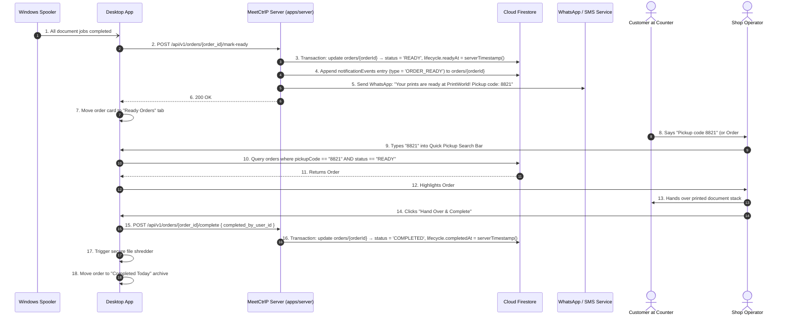

# Section 09: Fulfillment, Ready States & Customer Handover

## 1. Product Requirements & MVP Scope

Based on `FRD_MVP.md` and `meetctrlp_print_shop_partner_desktop_mvp_requirements.md`:

| Feature | Scope | Rationale / Day-0 Requirement |
|---------|-------|-------------------------------|
| **Ready for Pickup State** | **T0** | Clear separation between "Print Spooled" and "Prints Stacked on Counter Ready for Collection". |
| **Customer Ready Notification** | **T0** | Automated WhatsApp / SMS / Push alert triggered when order reaches `READY`. |
| **Customer Pickup Verification** | **T0** | Fast identification via Order Number or 4-digit pickup code to prevent handing prints to wrong person. |
| **Physical Handover Completion** | **T0** | Operator marks order completed, finalizing the operational loop. |
| **Completed Orders History** | **T0** | Searchable log of finished orders for daily accountability. |
| **QR Code Scanner Integration** | **T1** | Optical barcode scanner hardware deferred to post-MVP; on-screen keyboard search is Day-0. |

---

## 2. Data Points & Storage Matrix (Cloud Firestore vs Notification Delivery)

Fulfillment states, pickup codes, and customer notifications are stored in **Cloud Firestore**:

| Data Point | Origin / Capture Source | Client Capture Method | Transport / DTO Format | Destination Storage | Storage Format & Constraints |
| :--- | :--- | :--- | :--- | :--- | :--- |
| **Pickup Code** | Random Generator on Order | Printed / Shown in Web App | JSON `{ pickup_code: "8821" }` | **Cloud Firestore** | `orders/{orderId}.pickupCode` (string) |
| **Ready Timestamp** | Spooler Completion Trigger | `DateTime.UtcNow` | JSON `{ ready_at: "2026-09-26..." }` | **Cloud Firestore** | `orders/{orderId}.lifecycle.readyAt` (Timestamp) |
| **Completed Timestamp**| Operator Handover Click | `DateTime.UtcNow` | JSON `{ completed_at: "..." }` | **Cloud Firestore** | `orders/{orderId}.lifecycle.completedAt` (Timestamp) |
| **Handover Notes** | Operator Input | WPF TextBox (Optional) | JSON `{ handover_notes: "..." }` | **Cloud Firestore** | `orders/{orderId}.handoverNotes` (string) |
| **Customer Notification**| Cloud Notification Trigger | WhatsApp / SMS Dispatch | Webhook Payload | **Cloud Firestore** | `orders/{orderId}.notificationEvents[]` (embedded array) |
| **Completed By User ID**| Staff Session | `AuthSession.User.Id` | JSON `{ completed_by_user_id }` | **Cloud Firestore** | `orders/{orderId}.completedByUserId` (string ref → `users/{userId}`) |

---

## 3. End-to-End Handover Data Flow



---

## 4. Screen UI & Interaction Design

In **Screen 2: Orders (Ready Tab)**:
- **Quick Lookup Bar:**
  - Shortcut: Press `F2` or `Ctrl + P` to focus.
  - Placeholder: `Type 4-digit pickup code or order #...`
- **Ready Order Card:**
  - Header: Order Number (`ORD-1042`) + Time in Ready state (`Ready for 14 min`).
  - Customer Pickup Code Badge: `Code: 8821` (bold monospace font).
  - Summary: `1 File • 18 Pages • Color • ₹180.00 (PAID)`.
  - Action Button: **Hand Over & Complete** (Primary Green, 12px radius).

---

## 5. Firestore Collection Blueprint & Constraints

### 5.1 Mark Order READY (Server-side Transaction)

```typescript
import { getFirebaseFirestore } from "@ctrlp/firebase";
import { FieldValue } from "firebase-admin/firestore";

const db = getFirebaseFirestore();

async function markOrderReady(shopId: string, orderId: string): Promise<void> {
  await db.runTransaction(async (tx) => {
    const orderRef = db.doc(`shops/${shopId}/orders/${orderId}`);
    const orderSnap = await tx.get(orderRef);

    if (!orderSnap.exists) throw new Error(`Order ${orderId} not found`);

    const order = orderSnap.data()!;
    if (order.status !== "PRINTING") {
      throw new Error(`Cannot mark READY from status: ${order.status}`);
    }

    tx.update(orderRef, {
      status: "READY",
      "lifecycle.readyAt": FieldValue.serverTimestamp(),
      updatedAt: FieldValue.serverTimestamp(),
      // Append a notification event record inline
      notificationEvents: FieldValue.arrayUnion({
        type: "ORDER_READY",
        channel: "WHATSAPP",
        dispatchedAt: new Date().toISOString(),
      }),
    });
  });
  // Cloud Function / backend event listener will trigger the actual WhatsApp/SMS dispatch
}
```

### 5.2 Complete Order on Handover (Server-side Transaction)

```typescript
async function completeOrder(
  shopId: string,
  orderId: string,
  completedByUserId: string,
  handoverNotes?: string
): Promise<void> {
  await db.runTransaction(async (tx) => {
    const orderRef = db.doc(`shops/${shopId}/orders/${orderId}`);
    const orderSnap = await tx.get(orderRef);

    if (!orderSnap.exists) throw new Error(`Order ${orderId} not found`);

    const order = orderSnap.data()!;
    if (order.status !== "READY") {
      throw new Error(`Cannot complete order from status: ${order.status}`);
    }

    const updatePayload: Record<string, unknown> = {
      status: "COMPLETED",
      "lifecycle.completedAt": FieldValue.serverTimestamp(),
      completedByUserId,
      updatedAt: FieldValue.serverTimestamp(),
    };
    if (handoverNotes) updatePayload.handoverNotes = handoverNotes;

    tx.update(orderRef, updatePayload);
  });
}
```

### 5.3 Pickup Code Lookup

```typescript
/**
 * Look up a READY order by its 4-digit pickup code within a shop.
 * Path: shops/{shopId}/orders/{orderId}
 */
async function lookupByPickupCode(
  shopId: string,
  pickupCode: string
) {
  const snapshot = await db
    .collection("shops")
    .doc(shopId)
    .collection("orders")
    .where("pickupCode", "==", pickupCode)
    .where("status", "==", "READY")
    .get();

  if (snapshot.empty) return null;

  const doc = snapshot.docs[0];
  return { id: doc.id, ...doc.data() };
}
```

> [!NOTE]
> The Firestore query above (`pickupCode + status`) requires a composite index on the `orders` subcollection. Add it to `firestore.indexes.json`:
> ```json
> {
>   "collectionGroup": "orders",
>   "queryScope": "COLLECTION",
>   "fields": [
>     { "fieldPath": "pickupCode", "order": "ASCENDING" },
>     { "fieldPath": "status",     "order": "ASCENDING" }
>   ]
> }
> ```
