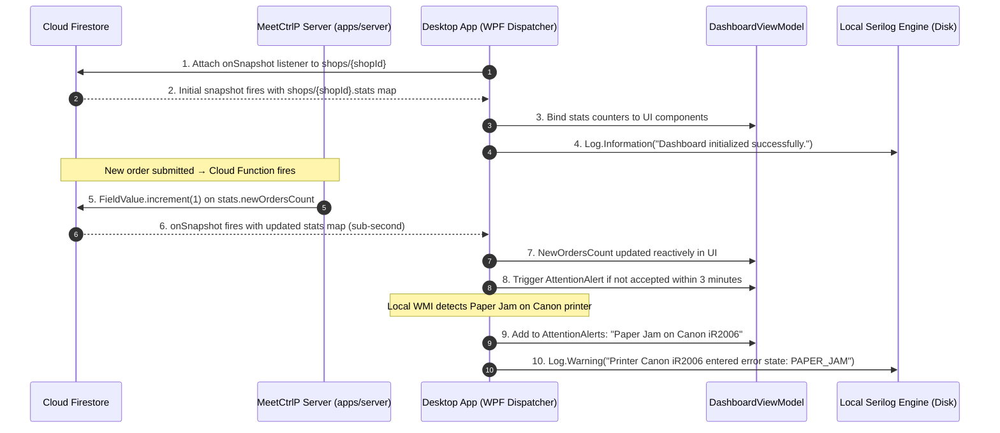

# Section 11: Operational Dashboard, Health Monitoring & Diagnostics

## 1. Product Requirements & MVP Scope

Based on `FRD_MVP.md` and `meetctrlp_print_shop_partner_desktop_mvp_requirements.md`:

| Feature | Scope | Rationale / Day-0 Requirement |
|---------|-------|-------------------------------|
| **Operational Overview Counters** | **T0** | Glanceable counters: New, Active/Printing, Ready, Completed Today. |
| **Financial Pulse Cards** | **T0** | Realtime cash vs online revenue tracking for daily counter balancing. |
| **Attention Required Panel** | **T0** | Proactively highlights bottlenecks (unaccepted orders > 3m, jammed printers, failed jobs). |
| **Printer Health Strip** | **T0** | Immediate status of all local printing hardware without visiting Settings. |
| **Recent Orders Feed** | **T0** | Quick-action list of the 5 most recent orders. |
| **Diagnostic Utilities** | **T0** | One-click Test Print, Cloud Connectivity Ping, and Spooler Restart helper. |
| **Structured Local Logging** | **T0** | Serilog rolling file logs for troubleshooting shop hardware issues. |
| **Advanced Historical Analytics** | **Later** | Weekly trends and customer repeat analytics deferred to web portal. |

---

## 2. Data Points & Storage Matrix (Cloud Firestore Stats vs Client Serilog Logs)

Dashboard counters are maintained as an embedded `stats` map inside the `/shops/{shopId}` document using `FieldValue.increment()`, enabling realtime reactive updates via `onSnapshot`. Diagnostic traces are saved to rotating disk files:

| Data Point | Origin / Capture Source | Client Capture Method | Transport / DTO Format | Destination Storage | Storage Format & Constraints |
| :--- | :--- | :--- | :--- | :--- | :--- |
| **New Orders Count** | `orders/{orderId}.status == 'SUBMITTED'` | `onSnapshot` on shop doc | Firestore snapshot | **Cloud Firestore** | `shops/{shopId}.stats.newOrdersCount` (number) |
| **Active Printing Count**| `status IN ('SHOP_ACCEPTED', 'PRINTING')`| `onSnapshot` on shop doc | Firestore snapshot | **Cloud Firestore** | `shops/{shopId}.stats.activeOrdersCount` (number) |
| **Ready Orders Count** | `orders/{orderId}.status == 'READY'` | `onSnapshot` on shop doc | Firestore snapshot | **Cloud Firestore** | `shops/{shopId}.stats.readyOrdersCount` (number) |
| **Completed Today Count**| `status == 'COMPLETED' && today`| `onSnapshot` on shop doc | Firestore snapshot | **Cloud Firestore** | `shops/{shopId}.stats.completedTodayCount` (number) |
| **Gross Paid Revenue** | `payments.status == 'PAID'` | `onSnapshot` on shop doc | Firestore snapshot | **Cloud Firestore** | `shops/{shopId}.stats.grossPaidTodayPaise` (number, integer minor units) |
| **Cash in Drawer** | `method == 'CASH' && PAID` | `onSnapshot` on shop doc | Firestore snapshot | **Cloud Firestore** | `shops/{shopId}.stats.cashInDrawerPaise` (number, integer minor units) |
| **Cash Pending** | `method == 'CASH' && PENDING` | `onSnapshot` on shop doc | Firestore snapshot | **Cloud Firestore** | `shops/{shopId}.stats.cashPendingPaise` (number, integer minor units) |
| **Diagnostic Log Event**| Serilog Event Stream | `Log.Information() / Error()` | Local JSON Log Format | Client Disk | `%LOCALAPPDATA%\MeetCtrlP\Logs\app-YYYYMMDD.log` |
| **Hardware Fault Alert**| WMI / Spooler Monitor | Polled Every 5 Seconds | In-Memory `AttentionItem` | Client RAM | Bound to Attention Required Panel |

---

## 3. End-to-End Dashboard & Telemetry Data Flow



---

## 4. Technical Build Specification

### 4.1 Live Shop Stats Listener (Firestore `onSnapshot`)

Dashboard counters are read reactively from the `stats` map embedded in the `/shops/{shopId}` document. No REST polling is needed — the `onSnapshot` listener fires instantly whenever any stat is incremented on the server.

```typescript
import { getFirebaseFirestore } from "@ctrlp/firebase";

const db = getFirebaseFirestore();

/**
 * Attach a realtime listener to the shop document's embedded stats map.
 * Fires immediately with the current snapshot, then on every change.
 */
function subscribeToDashboardStats(
  shopId: string,
  onStats: (stats: ShopStats) => void
) {
  return db.doc(`shops/${shopId}`).onSnapshot(
    (snapshot) => {
      if (!snapshot.exists) return;
      const data = snapshot.data()!;
      onStats(data.stats as ShopStats);
    },
    (error) => {
      console.error("Dashboard stats listener error (will auto-retry):", error);
    }
  );
}

interface ShopStats {
  newOrdersCount: number;
  activeOrdersCount: number;
  readyOrdersCount: number;
  completedTodayCount: number;
  grossPaidTodayPaise: number;
  cashInDrawerPaise: number;
  cashPendingPaise: number;
}
```

### 4.2 Atomic Stat Increment When Order Status Changes

Stats are updated atomically on the server (Cloud Function or `apps/server` handler) using `FieldValue.increment()`. This is safe under concurrent load — no read-modify-write race conditions.

```typescript
import { getFirebaseFirestore } from "@ctrlp/firebase";
import { FieldValue } from "firebase-admin/firestore";

const db = getFirebaseFirestore();

/** Called by Cloud Function when an order transitions to COMPLETED */
async function onOrderCompleted(shopId: string, amountPaidPaise: number, paymentMethod: "ONLINE" | "CASH"): Promise<void> {
  const shopRef = db.doc(`shops/${shopId}`);

  await shopRef.update({
    "stats.completedTodayCount": FieldValue.increment(1),
    "stats.readyOrdersCount": FieldValue.increment(-1),        // order leaves READY state
    "stats.grossPaidTodayPaise": FieldValue.increment(amountPaidPaise),
    ...(paymentMethod === "CASH" && {
      "stats.cashInDrawerPaise": FieldValue.increment(amountPaidPaise),
      "stats.cashPendingPaise": FieldValue.increment(-amountPaidPaise), // cash collected, no longer pending
    }),
    updatedAt: FieldValue.serverTimestamp(),
  });
}

/** Called by Cloud Function when a new order is submitted */
async function onOrderSubmitted(shopId: string): Promise<void> {
  await db.doc(`shops/${shopId}`).update({
    "stats.newOrdersCount": FieldValue.increment(1),
    updatedAt: FieldValue.serverTimestamp(),
  });
}

/** Called by Cloud Function when an order is accepted by the shop */
async function onOrderAccepted(shopId: string): Promise<void> {
  await db.doc(`shops/${shopId}`).update({
    "stats.newOrdersCount": FieldValue.increment(-1),
    "stats.activeOrdersCount": FieldValue.increment(1),
    updatedAt: FieldValue.serverTimestamp(),
  });
}

/** Called by Cloud Function when an order transitions to READY */
async function onOrderReady(shopId: string): Promise<void> {
  await db.doc(`shops/${shopId}`).update({
    "stats.activeOrdersCount": FieldValue.increment(-1),
    "stats.readyOrdersCount": FieldValue.increment(1),
    updatedAt: FieldValue.serverTimestamp(),
  });
}
```

> [!TIP]
> `FieldValue.increment()` is a Firestore server-side atomic operation. It never requires a read before writing, making it safe under high-concurrency multi-agent shop environments where multiple operators are completing orders simultaneously.

> [!NOTE]
> All monetary values (`grossPaidTodayPaise`, `cashInDrawerPaise`, `cashPendingPaise`) are stored as **integer minor units (paise)** — the same constraint as the previous PostgreSQL `BIGINT` columns. Display layer divides by 100 for ₹ rendering.

### 4.3 Serilog File-Based Rolling Diagnostics

```csharp
Log.Logger = new LoggerConfiguration()
    .MinimumLevel.Information()
    .WriteTo.File(
        path: Path.Combine(Environment.GetFolderPath(Environment.SpecialFolder.LocalApplicationData), "MeetCtrlP", "Logs", "meetctrlp-.log"),
        rollingInterval: RollingInterval.Day,
        fileSizeLimitBytes: 25 * 1024 * 1024,
        retainedFileCountLimit: 7,
        outputTemplate: "{Timestamp:yyyy-MM-dd HH:mm:ss.fff zzz} [{Level:u3}] {Message:lj}{NewLine}{Exception}"
    )
    .CreateLogger();
```

---

## 5. Screen UI: Screen 1 (Dashboard)

```text
┌────────────────────────────────────────────────────────────────────────────────────────┐
│ [Logo] MeetCtrlP Desktop   [Front Desk Billing PC]   ● Online   Agent v1.0.0   [Sign Out]│
├────────────────────────────────────────────────────────────────────────────────────────┤
│  OPERATIONAL OVERVIEW (TODAY)                                                          │
│  ┌───────────────┐ ┌───────────────┐ ┌───────────────┐ ┌───────────────┐              │
│  │ 3 New Orders  │ │ 2 Printing    │ │ 5 Ready Pickup│ │ 42 Completed  │              │
│  │ Action Needed │ │ Active Spool  │ │ At Counter    │ │ ₹1,850 Gross  │              │
│  └───────────────┘ └───────────────┘ └───────────────┘ └───────────────┘              │
│                                                                                        │
│  FINANCIAL OVERVIEW                                    ATTENTION REQUIRED              │
│  ┌────────────────────────────────────────────────┐   ┌──────────────────────────────┐ │
│  │ Total Gross: ₹1,850.00                         │   │ ⚠ Paper Jam: HP LaserJet     │ │
│  │ Online Settled: ₹1,410.00                      │   │ ⚠ Order #1048 waiting > 4m   │ │
│  │ Cash in Drawer: ₹440.00                        │   └──────────────────────────────┘ │
│  │ Cash Pending:   ₹65.00                         │                                    │
│  └────────────────────────────────────────────────┘   PRINTER HEALTH                   │
│                                                       ┌──────────────────────────────┐ │
│  RECENT ORDERS FEED                                   │ ● Canon iR2006 (Idle) - B&W  │ │
│  ORD-1048  • 12 pages • B&W  • ₹24.00 • [Accept] [Rej]│ ● Epson L805  (Idle) - Color│ │
│  ORD-1047  • 35 pages • Color• ₹175.00• [Printing...] │ ✕ HP M1005    (Jam)  - B&W  │ │
│  ORD-1046  • 2 pages  • B&W  • ₹4.00  • [Ready]       └──────────────────────────────┘ │
└────────────────────────────────────────────────────────────────────────────────────────┘
```
