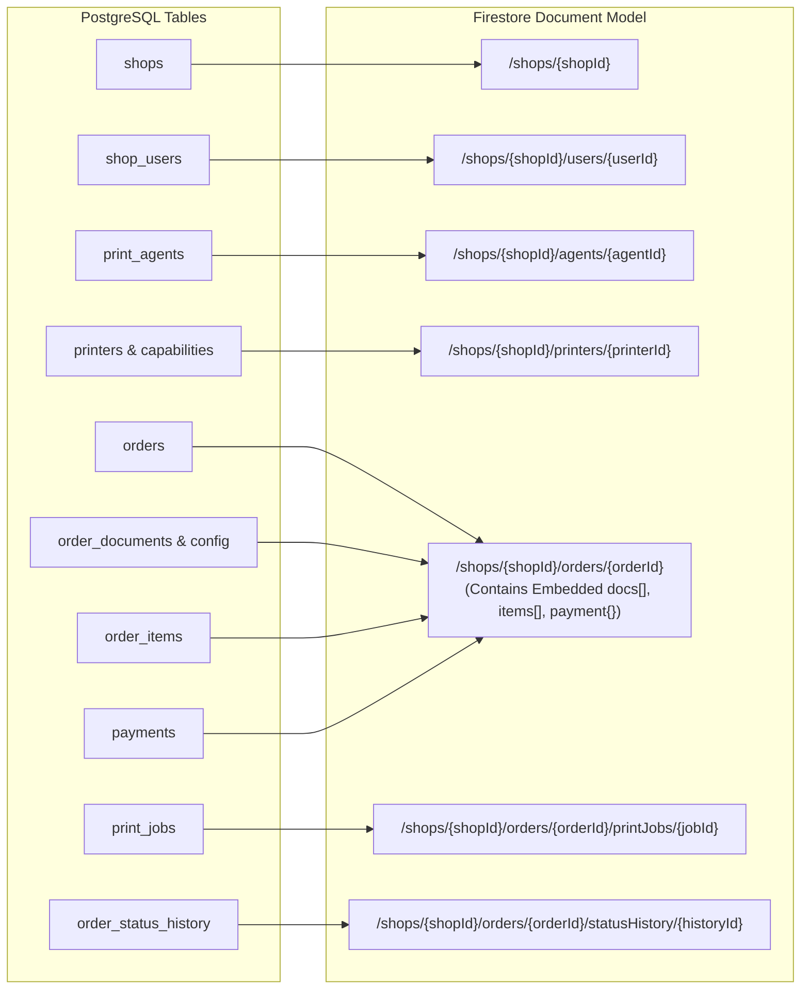

# PostgreSQL to Cloud Firestore Migration Guide

## 1. Paradigm Shift: Relational vs Document-Oriented Real-Time NoSQL

The transition from PostgreSQL to Cloud Firestore fundamentally changes how data is organized, accessed, and synchronized across MeetCtrlP:

| Feature | PostgreSQL (Relational) | Cloud Firestore (Document / NoSQL) |
| :--- | :--- | :--- |
| **Data Organization** | Normalized tables linked via Foreign Keys (`shops`, `orders`, `order_documents`, `payments`). | Hierarchical Collections, Subcollections, and Embedded Arrays/Maps. |
| **Read Operations** | Multi-table relational joins (`JOIN order_documents ON ... JOIN payments ON ...`). | Single-document atomic read. An order contains its documents, pricing items, and payment state in one read. |
| **Real-Time Delivery**| Complex WebSocket or SSE server layer required to stream row updates. | **Native real-time streaming listeners (`onSnapshot`)** with sub-second push directly to clients. |
| **Offline Resilience** | Requires local SQLite journal and custom sync replay engine. | **Native offline persistence** built directly into the Firestore SDK. |
| **Financial Integrity**| Strict `CHECK` constraints and `BIGINT` minor units. | Minor units (paise) stored as integers; validation enforced via TypeScript Drizzle/Zod schemas and Firestore Security Rules. |

---

## 2. Comprehensive Relational-to-Firestore Mapping Matrix



### Table-by-Table Translation Details

| PostgreSQL Table (v4) | Target Firestore Location | Denormalization & Structural Notes |
| :--- | :--- | :--- |
| `shops` | `/shops/{shopId}` | Root document. Embeds `address`, `capabilities`, `pricing`, and daily operational `stats`. |
| `shop_users` | `/shops/{shopId}/users/{userId}` | Subcollection under shop. Document ID matches user ID; `firebaseUid` stores Firebase Auth join key. |
| `shop_services` & `shop_pricing` | Embedded in `/shops/{shopId}.pricing` | Denormalized directly into shop document for instantaneous zero-join lookup on app launch. |
| `shop_capabilities` | Embedded in `/shops/{shopId}.capabilities` | Denormalized into shop document (`bwPrinting`, `colorPrinting`, `a4Printing`, `a3Printing`). |
| `shop_business_hours` | Embedded in `/shops/{shopId}.businessHours` | Array of 7 day-schedule objects inside shop document. |
| `print_agents` | `/shops/{shopId}/agents/{agentId}` | Subcollection under shop. Stores machine fingerprint, OS version, and live status. |
| `printers` | `/shops/{shopId}/printers/{printerId}` | Subcollection under shop. Embeds driver name, port, status, and baseline `defaultPrintSettings`. |
| `printer_capabilities` | Embedded in `/shops/{shopId}/printers/{printerId}` | Array of strings (`["A4", "A3", "BW", "COLOR"]`). |
| `printer_telemetry_logs` | Subcollection `/shops/{shopId}/printers/{printerId}/telemetry/{logId}` | Time-series telemetry log subcollection. |
| `orders` | `/shops/{shopId}/orders/{orderId}` | Core real-time order document. Embeds items, documents, and payment details. |
| `order_documents` & `print_configurations`| Embedded array `/shops/{shopId}/orders/{orderId}.documents[]` | Embedded array. Each entry holds file metadata, S3 storage key, SHA-256, and print config. |
| `order_items` | Embedded array `/shops/{shopId}/orders/{orderId}.items[]` | Embedded array. Frozen financial line items captured at order placement time. |
| `payments` | Embedded map `/shops/{shopId}/orders/{orderId}.payment` | Embedded map. Stores payment method, status, amount in paise, cashier details, and change returned. |
| `print_jobs` | Subcollection `/shops/{shopId}/orders/{orderId}/printJobs/{jobId}` | Subcollection for active Windows Spooler execution tracking. |
| `order_status_history` | Subcollection `/shops/{shopId}/orders/{orderId}/statusHistory/{historyId}` | Subcollection tracking lifecycle transition audit logs. |
| `document_access_logs` | Root collection `/accessLogs/{logId}` | Security audit log for PDF download, vector preview, spool, and zero-fill shredding. |
| `idempotency_keys` | Root collection `/idempotencyKeys/{key}` | Deduplication locks with 24-hour expiration TTL. |

---

## 3. Data Type Conversion Matrix

| PostgreSQL Data Type | Cloud Firestore Data Type | Conversion & Handling Rule |
| :--- | :--- | :--- |
| `UUID` | `string` | Converted to alphanumeric document ID (e.g. `ord_8821` or Firestore auto-ID). |
| `TIMESTAMPTZ` | `Timestamp` | Converted to `admin.firestore.Timestamp.fromDate(d)` / Google Cloud Firestore `Timestamp`. |
| `BIGINT` (Paise) | `number` (Integer) | Stored as integer number. Safe up to $2^{53}-1$ (₹90 trillion paise). |
| `VARCHAR` / `TEXT` | `string` | Stored as UTF-8 string. |
| `BOOLEAN` | `boolean` | Stored as native boolean `true` / `false`. |
| `JSONB` | `map` / `array` | Stored directly as native nested Firestore objects and arrays. |
| `ENUM` | `string` | Validated via TypeScript enum and Firestore Security Rules. |
| `NUMERIC(9,6)` (Coordinates) | `GeoPoint` | Stored as `new admin.firestore.GeoPoint(latitude, longitude)`. |

---

## 4. Query & Index Migration

In PostgreSQL, queries relied on compound B-Tree indexes. In Cloud Firestore, single-field indexes are automatic, but compound queries require explicit composite indexes defined in `firestore.indexes.json`.

### Example 1: Active Order Queue Stream
- **Postgres Query:**
  ```sql
  SELECT * FROM orders 
  WHERE shop_id = '9b1deb4d...' 
    AND status IN ('SUBMITTED', 'SHOP_ACCEPTED', 'PRINTING')
  ORDER BY created_at DESC;
  ```
- **Firestore Query (Node / C#):**
  ```typescript
  db.collection("shops").doc(shopId).collection("orders")
    .where("status", "in", ["SUBMITTED", "SHOP_ACCEPTED", "PRINTING"])
    .orderBy("lifecycle.createdAt", "desc")
    .onSnapshot((snapshot) => { ... });
  ```
- **Required Composite Index (`firestore.indexes.json`):**
  ```json
  {
    "collectionGroup": "orders",
    "queryScope": "COLLECTION",
    "fields": [
      { "fieldPath": "status", "order": "ASCENDING" },
      { "fieldPath": "lifecycle.createdAt", "order": "DESCENDING" }
    ]
  }
  ```

---

## 5. End-to-End Migration Script (TypeScript / Node.js)

The migration script reads existing PostgreSQL data in batches via Drizzle ORM and writes hierarchical Firestore documents using `writeBatch()` (chunked into transactions of 500 documents max):

```typescript
import { getDb } from "@/src/db/client";
import { getFirebaseFirestore } from "@ctrlp/firebase";
import { FieldValue, Timestamp, GeoPoint } from "firebase-admin/firestore";

export async function migratePostgresToFirestore() {
  const pg = getDb();
  const firestore = getFirebaseFirestore();

  console.log("Starting PostgreSQL to Cloud Firestore migration...");

  // 1. Migrate Shops
  const shops = await pg.query.shops.findMany();
  for (const shop of shops) {
    const shopRef = firestore.doc(`shops/${shop.id}`);
    
    // Fetch associated services, pricing, and capabilities
    const capabilities = await pg.query.shopCapabilities.findFirst({
      where: (caps, { eq }) => eq(caps.shopId, shop.id)
    });

    const pricingRules = await pg.query.shopPricing.findMany({
      where: (p, { eq, and }) => and(eq(p.shopId, shop.id), eq(p.isActive, true))
    });

    const hours = await pg.query.shopBusinessHours.findMany({
      where: (h, { eq }) => eq(h.shopId, shop.id)
    });

    await shopRef.set({
      id: shop.id,
      name: shop.name,
      slug: shop.slug,
      phone: shop.phone,
      email: shop.email,
      status: shop.status,
      address: {
        line1: shop.addressLine1,
        line2: shop.addressLine2,
        city: shop.city,
        state: shop.state,
        postalCode: shop.postalCode,
        country: shop.country,
        geoPoint: (shop.latitude && shop.longitude) 
          ? new GeoPoint(Number(shop.latitude), Number(shop.longitude)) 
          : null
      },
      capabilities: {
        bwPrinting: capabilities?.bwPrinting ?? true,
        colorPrinting: capabilities?.colorPrinting ?? false,
        a4Printing: capabilities?.a4Printing ?? true,
        a3Printing: capabilities?.a3Printing ?? false
      },
      pricing: {
        currency: "INR",
        unit: "PER_PAGE",
        bwA4PricePaise: pricingRules.find(r => r.colorMode === "BW" && r.paperSize === "A4")?.priceMinorUnits ?? 200,
        colorA4PricePaise: pricingRules.find(r => r.colorMode === "COLOR" && r.paperSize === "A4")?.priceMinorUnits ?? 1000,
        colorA3PricePaise: pricingRules.find(r => r.colorMode === "COLOR" && r.paperSize === "A3")?.priceMinorUnits ?? 2500,
        updatedAt: Timestamp.now()
      },
      businessHours: hours.map(h => ({
        dayOfWeek: h.dayOfWeek,
        opensAt: h.opensAt,
        closesAt: h.closesAt,
        isClosed: h.isClosed
      })),
      createdAt: Timestamp.fromDate(shop.createdAt),
      updatedAt: Timestamp.fromDate(shop.updatedAt)
    });

    // 2. Migrate Shop Users
    const users = await pg.query.shopUsers.findMany({
      where: (u, { eq }) => eq(u.shopId, shop.id)
    });
    for (const user of users) {
      await shopRef.collection("users").doc(user.id).set({
        id: user.id,
        shopId: shop.id,
        firebaseUid: user.firebaseUid,
        name: user.name,
        phone: user.phone,
        email: user.email,
        role: user.role,
        status: user.status,
        lastLoginAt: user.lastLoginAt ? Timestamp.fromDate(user.lastLoginAt) : null,
        createdAt: Timestamp.fromDate(user.createdAt),
        updatedAt: Timestamp.fromDate(user.updatedAt)
      });
    }

    // 3. Migrate Orders (Denormalizing Documents, Items, and Payment)
    const orders = await pg.query.orders.findMany({
      where: (o, { eq }) => eq(o.shopId, shop.id)
    });

    for (const order of orders) {
      const orderRef = shopRef.collection("orders").doc(order.id);

      const docs = await pg.query.orderDocuments.findMany({
        where: (d, { eq }) => eq(d.orderId, order.id)
      });

      const items = await pg.query.orderItems.findMany({
        where: (i, { eq }) => eq(i.orderId, order.id)
      });

      const payment = await pg.query.payments.findFirst({
        where: (p, { eq }) => eq(p.orderId, order.id)
      });

      const embeddedDocs = [];
      for (const d of docs) {
        const config = await pg.query.printConfigurations.findFirst({
          where: (c, { eq }) => eq(c.orderDocumentId, d.id)
        });
        embeddedDocs.push({
          id: d.id,
          originalFilename: d.originalFilename,
          storageKey: d.storageKey,
          mimeType: d.mimeType,
          fileSizeBytes: Number(d.fileSizeBytes),
          pageCount: d.pageCount,
          sha256Hash: d.sha256Hash,
          status: d.status,
          config: config ? {
            colorMode: config.colorMode,
            copies: config.copies,
            paperSize: config.paperSize,
            pageSelection: config.pageSelection
          } : null,
          shreddedAt: d.shreddedAt ? Timestamp.fromDate(d.shreddedAt) : null
        });
      }

      await orderRef.set({
        id: order.id,
        orderNumber: order.orderNumber,
        shopId: order.shopId,
        printUserId: order.printUserId,
        status: order.status,
        pickupCode: order.pickupCode,
        amounts: {
          currency: order.currency,
          subtotalPaise: Number(order.subtotalMinorUnits),
          taxPaise: Number(order.taxMinorUnits),
          discountPaise: Number(order.discountMinorUnits),
          totalPaise: Number(order.totalMinorUnits)
        },
        payment: payment ? {
          method: payment.method,
          status: payment.status,
          amountPaise: Number(payment.amountMinorUnits),
          paidAt: payment.paidAt ? Timestamp.fromDate(payment.paidAt) : null,
          cashTenderedPaise: payment.cashTenderedMinorUnits ? Number(payment.cashTenderedMinorUnits) : null,
          changeReturnedPaise: payment.changeReturnedMinorUnits ? Number(payment.changeReturnedMinorUnits) : null,
          collectedByUserId: payment.collectedByShopUserId,
          collectedAt: payment.collectedAt ? Timestamp.fromDate(payment.collectedAt) : null
        } : null,
        documents: embeddedDocs,
        items: items.map(item => ({
          description: item.description,
          quantity: item.quantity,
          unitPricePaise: Number(item.unitPriceMinorUnits),
          totalPricePaise: Number(item.totalPriceMinorUnits)
        })),
        rejection: {
          rejectedAt: order.rejectedAt ? Timestamp.fromDate(order.rejectedAt) : null,
          reason: order.rejectionReason,
          category: order.rejectionCategory
        },
        lifecycle: {
          createdAt: Timestamp.fromDate(order.createdAt),
          acceptedAt: order.acceptedAt ? Timestamp.fromDate(order.acceptedAt) : null,
          readyAt: order.readyAt ? Timestamp.fromDate(order.readyAt) : null,
          completedAt: order.completedAt ? Timestamp.fromDate(order.completedAt) : null,
          cancelledAt: order.cancelledAt ? Timestamp.fromDate(order.cancelledAt) : null,
          acceptedByUserId: order.acceptedByUserId,
          completedByUserId: order.completedByUserId
        },
        updatedAt: Timestamp.fromDate(order.updatedAt)
      });
    }
  }

  console.log("Migration to Cloud Firestore completed successfully!");
}
```
