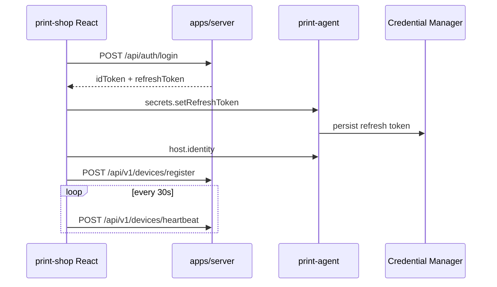
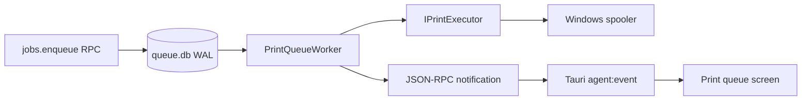

# CtrlP Print Shop Desktop — implementation guide

**Audience:** Engineers and coding agents working on the Windows shop desktop.  
**Product contract:** [`Print Shop Partner Desktop MVP.md`](./Print%20Shop%20Partner%20Desktop%20MVP.md) (screens, FR-01–FR-46).  
**Built vs leftover checklist:** [`CtrlP_Print_Shop_Desktop_MVP_Progress.md`](./CtrlP_Print_Shop_Desktop_MVP_Progress.md).  
**Stack reference (IPC, sidecar, commands):** [`docs/arc/PRINT_SHOP_DESKTOP.md`](../../arc/PRINT_SHOP_DESKTOP.md).  
**App handbooks:** [`apps/print-shop/AGENTS.md`](../../../apps/print-shop/AGENTS.md), [`apps/print-agent/AGENTS.md`](../../../apps/print-agent/AGENTS.md).

Read this file when you need to understand **how the shipped slices work**, **where code lives**, and **what is intentionally not wired yet**. Update it in the same PR as behavior changes.

---

## 1. Documentation map

| Question | Document |
| --- | --- |
| What should the product do? | PRD (`Print Shop Partner Desktop MVP.md`) |
| What is done vs still missing? | `CtrlP_Print_Shop_Desktop_MVP_Progress.md` |
| How does Tauri ↔ agent IPC work? | `docs/arc/PRINT_SHOP_DESKTOP.md` |
| How do orders, jobs, and the queue fit together? | **This file** |
| UI / agent edit rules | `apps/print-shop/AGENTS.md`, `apps/print-agent/AGENTS.md` |
| Firestore shape (target) | `docs/desktop app feature MBP/firestore_schema_blueprint.json` |
| Shared Zod contracts | `packages/schemas` (`orders`, `print-jobs`, printers) |

---

## 2. Architectural boundaries (non-negotiable)

1. **No Firebase client SDK** in `apps/print-shop`. All shop business state goes through **`apps/server`** (REST + SSE).
2. **React and Rust never call Win32 or the spooler.** Printer discovery, capabilities, and PDF/image execution live in **`apps/print-agent`** (`Ctrlp.PrintAgent.Windows`).
3. **Firestore is authoritative** for orders, `printJobs`, printer inventory, and document audit. The agent SQLite file is only a **local execution journal** for work handed to Windows.
4. **Do not stream raw PDF bytes through `WritePrinter`.** The agent renders PDF with PDFium (`Docnet.Core`) and uses `PrintDocument` for the installed driver; JPEG/PNG take the same driver path.
5. **Privacy:** Do not log signed document URLs, bearer tokens, document bytes, or local staging paths in UI, Rust, or agent logs.

```text
Customer app ──► apps/server ──► Firestore
                      │
                      │  REST + SSE (Bearer id token)
                      ▼
              apps/print-shop (React)
                      │
                      │  Tauri invoke → named pipe JSON-RPC
                      ▼
              apps/print-agent (C#)
                      │
                      ▼
              Windows Print Spooler
```

---

## 3. What is built (summary)

| Area | Shipped behavior |
| --- | --- |
| Auth & device | Login/register, refresh token in Credential Manager, device register + 30s heartbeat |
| Printers | Local discovery + capabilities, cloud sync, default / enabled / offer color-A3 |
| Orders UI | List + filters + search, accept/reject, details, transitions to ready/complete |
| Order stream | Server SSE: snapshot, order deltas, print-job deltas; client reconnect + REST bootstrap |
| Documents | Short-lived download URL, SHA-256 check, preview in browser, audit DOWNLOADED/PREVIEWED |
| Cloud print jobs | Server routes compatible work, device agent claims it with a lease, and Firestore state streams to UI |
| Local queue | SQLite WAL journal, background worker, staged-file hash validation, cancel/retry RPC, job notifications to UI |
| Agent lifecycle | Stable pipe name `ctrlp-print-agent`, per-user token file, single-instance mutex |

**Implemented with operational limits:** cloud-to-agent staging, PDF/JPEG/PNG rendering, Windows spool submission, cash collection, and basic dashboard order counts. A spool acceptance is not proof that paper exited the device; printers/drivers can consume jobs immediately, so the agent records a spooler ID only when observable. Customer-facing synchronization, richer metrics, remote-object deletion, and broader automated coverage remain.

### Current source-of-truth rule

Do not infer a physical print from an order or a cloud job alone:

| State | Authority | What it currently proves |
| --- | --- | --- |
| `ShopOrder` / `CloudPrintJob` | Firestore through `apps/server` | The shop accepted/managed the business request and selected a printer. |
| `JobDto` in `queue.db` | C# agent SQLite | The local agent owns durable execution metadata and cloud order/job correlation. |
| Windows spooler job | Windows | A successful `PrintDocument` submission is recorded as completed; its spooler job ID is attached when the driver leaves it observable. It is not a physical-paper guarantee. |

The background synchronizer is the only cloud-to-local handoff path. It claims the assigned job before downloading, verifies the SHA-256 after staging, and atomically creates the local row. It avoids duplicate spooling after restart by turning ambiguous in-flight work into an actionable failure.

---

## 4. End-to-end flows

### 4.1 Session and device



- **UI:** `LoginScreen`, `App.tsx` (`enterSession`, `connectDevice`), `lib/cloud.ts`.
- **Agent:** `secrets.*` handlers, `WindowsCredentialStore`.
- **Server:** auth routes, `devices/register`, `devices/heartbeat`.

### 4.2 Printer inventory

1. UI calls `list_printers` / `refresh_printers` (agent).
2. UI `POST /api/v1/shops/{shopId}/printers` with `agentId` + discovered printers.
3. UI `GET` printers and merges with live status (`lib/printers.ts`, `PrintersScreen`).
4. Operator `PATCH` default, enabled, offered color/A3.

Firestore path: `shops/{shopId}/printers/{printerId}` (`printerId` = SHA-256 of Windows queue name, first 32 hex chars — see `print-job.service.ts` `printerIdFor`).

### 4.3 Orders: REST bootstrap + SSE

On login, `App.tsx`:

1. `GET /api/v1/shops/{shopId}/orders` → `ORDERS_SNAPSHOT` into `orderStore`.
2. `streamShopOrders()` → `GET /api/v1/shops/{shopId}/orders/stream` (SSE).

SSE events (see `orders/stream/route.ts`):

| Event | Payload | Client handling |
| --- | --- | --- |
| `ORDERS_SNAPSHOT` | `{ orders }` | Replace list (`lib/orders.ts` `reduceOrderEvent`) |
| `ORDER_CREATED` | `ShopOrder` | Upsert |
| `ORDER_STATUS_CHANGED` | `ShopOrder` | Upsert |
| `PRINT_JOB_CHANGED` | `CloudPrintJob` | Merge into `jobsByOrderId[orderId]` |
| `ping` | `{}` | Ignored |

Initial print-job listener snapshots are suppressed on the server (`jobsSeeded` in `order.service.ts` `subscribeShopOrders`) so reconnect does not replay every historical job as a delta.

Client reconnect: exponential backoff in `streamShopOrders`; connection state surfaced as `orderStore.streamState` (`connected` / `reconnecting` / `offline`).

**Files:** `apps/print-shop/src/lib/cloud.ts`, `lib/orders.ts`, `lib/protocol.ts`, `screens/OrdersScreen.tsx`, `screens/OrderDetailsScreen.tsx`, `App.tsx`.

### 4.4 Order actions (shop operator)

| Action | API | Idempotency |
| --- | --- | --- |
| Accept | `POST .../orders/{id}/accept` | `idempotencyKey` + `currentStatus` |
| Reject | `POST .../orders/{id}/reject` | same |
| Mark printing | `POST .../printing` | same (often driven by job state on server) |
| Ready | `POST .../ready` | same |
| Complete | `POST .../complete` | same; cash orders may flip `payment.status` to PAID |

Server stores idempotency under `shops/{shopId}/idempotencyKeys/{key}` (order transitions).

### 4.5 Document preview (UI-only today)

`handlePreviewDocument` in `App.tsx`:

1. `GET .../documents/{docId}/download-url`
2. `fetch(url)` in the webview, SHA-256 compare to `sha256Hash`
3. `POST .../documents/{docId}/access` with `DOWNLOADED` then `PREVIEWED`
4. Open blob URL in a new window (revoked after 60s)

**Not done:** write file under `%LOCALAPPDATA%\Ctrlp\PrintAgent\jobs\{jobId}`, agent-side validation, `SPOOLED_TO_PRINTER` / `SHREDDED` on handoff.

### 4.6 Start printing (cloud job only today)

When the operator taps **Start printing** on an accepted order document:

1. UI picks first **enabled** printer with a `cloudId` (`handleDispatchOrderDocument`).
2. `POST /api/v1/shops/{shopId}/orders/{orderId}/jobs` with `printerId`, `documentId`, `idempotencyKey`, optional `overrides`.
3. Server `dispatchPrintJob` creates/returns a Firestore `printJobs` doc, resolves settings from document + printer preset + overrides, binds `agentId` from the printer record.
4. UI refreshes order + jobs; SSE may also emit `PRINT_JOB_CHANGED`.

**Important gap:** this path does **not** yet call `jobs.enqueue` on the agent or stage the PDF locally. Cloud and local queues are separate until the handoff slice is implemented.

### 4.7 Local print queue (agent)



- **Database:** `%LOCALAPPDATA%\Ctrlp\PrintAgent\queue.db`
- **Store:** `SqliteJobStore` — idempotent `idempotency_key`, max 500 queued rows, atomic `ClaimNext`
- **Recovery:** on `Initialize()`, rows in `printing` become `failed` (no silent re-spool after crash)
- **Worker:** `PrintQueueWorker` claims queued rows with a staged `document_path`
- **Executor today:** `UnavailablePrintExecutor` — fails safely until `Ctrlp.PrintAgent.Windows` implements `IPrintExecutor`
- **Notifications:** `job.started`, `job.completed`, `job.failed`, etc. (`RpcNotifications`) via `NamedPipeIpcServer.PublishAsync` → Tauri `agent:event` → `App.tsx` updates `jobs` state
- **UI:** `PrintQueueScreen` — cancel / retry (`jobs.cancel`, `jobs.retry`)

The current worker only claims records that have a staged `document_path`; the UI has no staging handoff yet, so normal cloud dispatch cannot accidentally invoke `UnavailablePrintExecutor`. Test/diagnostic enqueue remains useful for persistence, cancellation, retry, and event delivery—not for printing.

Enqueue request fields (contracts): `cloudJobId`, `documentSha256`, `resolvedSettings`, `idempotencyKey`, `pagesTotal`, plus legacy `documentPath` / `documentName` (path is **not** exposed on `JobDto` over IPC).

### 4.8 Agent process lifetime

- Tauri `boot.rs`: pipe `ctrlp-print-agent`, token persisted in app local data (`agent.pipe-token`), **no `--parent-pid`** in normal desktop boot (agent can outlive the window).
- Host: `Local\Ctrlp.PrintAgent` mutex — second process exits immediately.
- Optional `--parent-pid` still supported for dev/debug.

---

## 5. Server APIs (shop desktop consumer)

Base: `VITE_SERVER_BASE_URL` (default `http://localhost:3000`). Auth: `Authorization: Bearer {idToken}`.

| Concern | Methods |
| --- | --- |
| Auth | `/api/auth/login`, `register`, `refresh`, `logout`, `me` |
| Shop | `/api/v1/shops/profile`, `staff` |
| Device | `/api/v1/devices/register`, `heartbeat`, `offline` |
| Printers | `GET/POST /api/v1/shops/{shopId}/printers`, `PATCH .../printers/{id}`, telemetry POST |
| Orders | `GET /api/v1/shops/{shopId}/orders`, `GET .../{orderId}`, `POST .../accept|reject|printing|ready|complete` |
| Order stream | `GET /api/v1/shops/{shopId}/orders/stream` (SSE) |
| Print jobs | `GET/POST .../orders/{orderId}/jobs`, `PATCH .../jobs/{jobId}`, `POST .../jobs/{jobId}/retry` |
| Documents | download-url GET, access POST (`DOWNLOADED`, `PREVIEWED`, `SPOOLED_TO_PRINTER`, `SHREDDED`), shred POST |

DTOs and validation: `packages/schemas` (especially `print-jobs.ts`). Server implementation: `apps/server/src/modules/orders/order.service.ts`, `printing/print-job.service.ts`, `documents/document.service.ts`.

Print job statuses: `QUEUED` → `DISPATCHING` → `PRINTING` → `COMPLETED` | `FAILED` | `CANCELLED`. Server guards transitions in `assertJobTransition` and can advance order status when jobs complete.

---

## 6. Key files (quick index)

### print-shop (React + Tauri)

| Path | Role |
| --- | --- |
| `src/App.tsx` | Shell, order stream effect, dispatch/preview handlers, agent event listener |
| `src/lib/cloud.ts` | All HTTP + SSE |
| `src/lib/orders.ts` | `OrderStore` reducer |
| `src/lib/protocol.ts` | `ShopOrder`, `CloudPrintJob`, stream event types |
| `src/lib/agent.ts` | Tauri invoke wrapper |
| `src/screens/OrdersScreen.tsx` | Order list |
| `src/screens/OrderDetailsScreen.tsx` | Details + actions |
| `src/screens/PrintQueueScreen.tsx` | Local agent queue |
| `src/screens/PrintersScreen.tsx` | Printer config |
| `src-tauri/src/agent/boot.rs` | Sidecar spawn, stable token |
| `src-tauri/src/agent/bridge.rs` | RPC + `agent:event` |
| `src-tauri/src/commands.rs` | invoke → RPC map |

### print-agent (C#)

| Path | Role |
| --- | --- |
| `Host/Program.cs` | SQLite, worker, single-instance |
| `Core/Jobs/SqliteJobStore.cs` | Durable queue |
| `Core/Jobs/PrintQueueWorker.cs` | Background claim/execute |
| `Core/Jobs/UnavailablePrintExecutor.cs` | Safe stub until Windows PDF path |
| `Ipc/JsonRpc/JsonRpcSession.cs` | Notifications on active session |
| `Windows/Printing/WindowsPrintCatalog.cs` | Capabilities |
| `Contracts/Protocol/Messages.cs` | `JobDto`, enqueue fields |

### server

| Path | Role |
| --- | --- |
| `modules/orders/order.service.ts` | Orders CRUD, transitions, SSE subscribers |
| `modules/printing/print-job.service.ts` | Dispatch, update, retry, routing helpers |
| `app/api/v1/shops/.../orders/stream/route.ts` | SSE endpoint |

---

## 7. How to extend (agent checklist)

**New cloud field or API**

1. `packages/schemas`
2. `apps/server` service + route
3. `apps/print-shop/src/lib/protocol.ts` + `cloud.ts`
4. Screens / `App.tsx` as needed
5. Update this file + MVP progress checklist

**New agent RPC**

1. `Ctrlp.PrintAgent.Contracts` (method name + DTO)
2. Handler in `Core/Handlers`
3. `commands.rs` + `lib/agent.ts`
4. `docs/arc/PRINT_SHOP_DESKTOP.md` method table

**Cloud job → physical print (next major slice)**

1. Stage PDF under agent job directory after server dispatch (UI or agent download using short-lived URL — never log URL).
2. `jobs.enqueue` with `cloudJobId`, hash, resolved settings JSON.
3. Implement `IPrintExecutor` in Windows project; wire Host to use it instead of `UnavailablePrintExecutor`.
4. UI or agent PATCHes server job status / `spoolerJobId` / progress (agent must not hold long-lived Firebase credentials — prefer UI-mediated REST with id token, or a future device-scoped capability).
5. Mark document `SPOOLED_TO_PRINTER` / `SHREDDED` per document service.
6. Move FR rows in progress doc from Left to Built.

---

## 8. Verification

From repo root:

```powershell
pnpm --filter @ctrlp/schemas typecheck
pnpm --filter server typecheck
pnpm --filter print-shop typecheck
pnpm --filter print-shop test
pnpm agent:test
cargo check --manifest-path apps/print-shop/src-tauri/Cargo.toml
```

Full desktop dev (Windows): `pnpm desktop:dev` with `pnpm server:dev` for API + SSE.

### Completed automated checks for this slice

- `pnpm --filter @ctrlp/schemas typecheck`
- `pnpm --filter server typecheck`
- `pnpm --filter print-shop typecheck`
- `pnpm --filter print-shop test` (SSE message parsing and normalized order/job reducer included)
- `dotnet test apps/print-agent/Ctrlp.PrintAgent.sln -c Release` (SQLite persistence, claim, cancellation, retry, plus IPC tests)
- `dotnet build apps/print-agent/src/Ctrlp.PrintAgent.Host/Ctrlp.PrintAgent.Host.csproj -c Release`
- `cargo check --manifest-path apps/print-shop/src-tauri/Cargo.toml`

No physical-printer test is recorded for this slice because the PDF executor is intentionally unavailable. Do not mark FR-20–FR-23 complete until the Windows test matrix passes.

---

## 9. Changelog (documentation)

| Date | Note |
| --- | --- |
| 2026-09-29 | Initial guide: orders SSE, cloud print jobs, SQLite queue, detached agent, explicit cloud↔local handoff gap |
